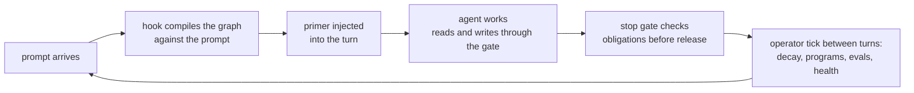

# Recall

**Push memory for AI agents.** Recall does not wait to be queried. It compiles what the agent needs to know and pushes it into every turn, holds the turn open until memory was actually consulted or updated, and keeps working the graph between calls.

*Defining the Push vs Pull Memory for Agentic AI.*

[](https://www.npmjs.com/package/recall-memory-substrate)
[](LICENSE)


## The problem with pull

Why should memory only answer when asked? An agent that has to remember to query its memory usually does not. And when it does ask, a pull pipeline is unpredictable at both ends: on the write side a separate extractor model decides what to keep, unschema'd, with no type, confidence, or contradiction link; on the read side top-k similarity returns a slice, not the relevant set, and a stale fact ranks exactly as well as the correction that replaced it.

Recall moves the work to the other side of the loop. Facts enter as typed, validated, confidence-calibrated cells at write time. Retrieval is compiled, ranked by evidence and graph structure, and delivered by hooks whether or not the agent thinks to ask.

## What push looks like

A prompt arrives. Before the model sees it, the hook has already injected this:

```
[Recall mini-index for THIS prompt (ids + titles only). You now know what
exists, so do not ask or assert blind:]
- dec_98ee "Canonical polarity locked for the memory axis"  [dec:98eec1f4]
- bel_2b0a "Cache layer is safe to remove"  [bel:2b0ae4c3]  [SUPERSEDED?]
- tsk_8686 "Wire the write surface into review"  [tsk:86868f00]
DIG REQUIRED: a row above is marked [SUPERSEDED?]; its title may be out of
date. Run recall compile "<task>" and recall cell show <id> on it BEFORE you
act on it.
```

No query was issued. The hook fired, ranked the graph against the prompt, flagged a belief that has been contradicted since it was written, and left an obligation the stop gate will check before the turn is allowed to end.

## What it does

- **Primer on every prompt.** A per-turn mini-index of the cells relevant to what the user just asked, with contradiction and staleness flags, injected through session hooks.
- **Compile packets.** `recall compile "<task>"` turns a task description into a budgeted, sectioned context packet: relevant memory, active beliefs, conflicts, dependencies, risks, open tasks, and a categorized expansion index, ranked by BM25 fused with graph degree, effective confidence, and recency.
- **A single write gate.** Every write is schema-validated, screened for credentials, deduplicated, checked for dangling references, and attenuated when a claim is stated more strongly than its evidence supports. The gate answers with guidance: similar cells to link, a better kind if one fits, what would restore capped confidence.
- **Turn gates.** A stop hook can hold the turn open until flagged cells were actually read, or until the agent wrote back what it learned. Forgetting stops being an option.
- **A runtime, not a store.** Decay ticks, effective-confidence recomputation, standing programs (watch, trend, drift, quorum, reflex, allocation), evals, and health checks run deterministically between turns, no model in the loop. The memory is alive between LLM calls.
- **Local first.** One SQLite file per graph on your machine. No server, no cloud, no API key. Portable JSON archives, plus importers for mem0, Zep, and Claude Code auto-memory.

## Install

```sh
npm install -g recall-memory-substrate
```

Requires Node.js 22.5 or newer (Recall uses the built-in `node:sqlite`; Node flags it experimental and prints a startup warning). Installs `recall` (CLI) and `recall-mcp` (MCP server).

## Sixty seconds

```sh
cd ~/code/my-project
recall project init                 # this project gets its own graph

echo '{ "kind": "dec",
        "title": "Use SQLite WAL mode for the event store",
        "body": "Single writer, concurrent readers.",
        "confidence": 0.9,
        "topics": ["storage"] }' > decision.json
recall admit --json decision.json
```

The gate answers, and argues back:

```json
{
  "accepted": true,
  "attenuations": ["confidence 0.90 -> 0.70"],
  "guidance": {
    "evidenceHint": "confidence was capped at 0.7; supply verification (checked, tested, external), sourceRefs, or a weighted supports edge to keep higher confidence",
    "candidateEdges": [
      { "handle": "bel_11ab", "title": "WAL checkpoints stall under heavy write load",
        "relation": "supports", "reason": "evidence for this claim raises its effective confidence" }
    ]
  }
}
```

Then read it back the way an agent would:

```sh
recall compile "how should the event store handle concurrent reads?"
```

To wire the push loop into an assistant, one command registers the hooks and the MCP server and imports existing auto-memory:

```sh
recall claude sync --apply     # Codex: recall codex sync --apply
```

Both preview their changes by default and back up any file they modify.

## How it works



Memory is a graph of ten typed cell kinds (decisions, observations, beliefs, tasks, objectives, risks, references, verifications, hypotheses, standing programs) connected by six signed relations. Support raises a belief's effective confidence, contradiction lowers it, supersession preserves history. Scores are derived by walking edges, never stored redundantly, so the graph cannot silently disagree with itself. Between turns the operator recomputes what changed, runs the standing programs, and emits witness cells only when something actually moved, with deterministic keys so nothing is ever recorded twice.

Reading is navigation, not a pre-committed blob: the compile packet leads with ids and one-line summaries, and the categorized expansion index tells the agent exactly what each handle is before it spends context expanding anything.

## Why Recall instead of a memory layer

A memory layer gives your code `search()` and `add()`, and memory works whenever the application remembers to call them. That is the pull assumption, and it is where the failure lives: the agent that did not know it should ask, the turn that ended without writing back, the stale fact nobody reconciled.

Recall attaches to the harness instead of the prompt chain. Delivery is the product: hooks fire on every prompt, gates check every turn end, and the substrate maintains itself on a schedule. mem0 and Zep are strong hosted retrieval layers; Letta gives an agent tools to edit its own memory blocks inside its context. All of them do the work inside or on demand of the LLM loop. Recall's work happens outside it.

## Recall and RAG

One boundary worth naming: Recall is not a million-document vector store. It is agent memory, and its value comes from use: cells are born from decisions made, observations verified, tasks opened and closed, and they compound the way working knowledge does.

That makes it the natural companion to RAG, not a replacement for it. The graph knows what the current branch of work is about: the active tasks, the live beliefs, the topics and entities in play. Use that to sculpt and scope retrieval: compile the packet, take its topics and entities into your RAG query, and a massive document store narrows to the slice that matters to this branch right now.

## Surfaces

- **CLI**: about fifty verbs covering writes, compile, search, graph structures, standing programs, evals, health, import and export, maintenance, and assistant sync. [Reference](docs/cli.md).
- **MCP**: eighteen tools over stdio for any MCP client: search, semantic retrieval, compile, gated writes with guidance, hyperedges, DAG analysis, programs, health. [Reference](docs/mcp.md).
- **Hooks**: session start directive, per-prompt primer, stop-gate obligations, optional fail-closed write-back gate. [Integrations](docs/integrations.md).
- **Library**: the same engine as TypeScript imports. [How Recall works](docs/overview.md).
- **Moving memory**: archives and importers, dry-run first, exactly idempotent. [Import and export](docs/import-export.md).

## Development

```sh
npm test                 # unit tests
npm run typecheck
npm run test:python      # python helper tests
npm run test:acceptance  # packs, installs into a clean project, exercises the installed artifact
npm run release:check    # all of the above plus a packaging dry run
```

## License

Apache-2.0
