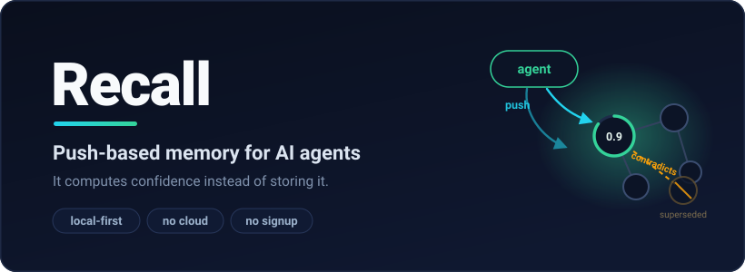

<p align="center">
  
</p>

<p align="center">
  <strong>Push-based memory for coding agents. It rides in context on every prompt, demotes a fact the moment something contradicts it, and carries across sessions without being asked. Local, free, yours.</strong>
</p>

<p align="center">
  
  
  
  
</p>

<p align="center">
  <a href="#install">install</a> &middot;
  <a href="#put-your-agent-on-it">agents</a> &middot;
  <a href="#where-memory-lives">memory</a> &middot;
  <a href="#the-hooks">hooks</a> &middot;
  <a href="#edge-programs">programs</a> &middot;
  <a href="#the-extensions">extensions</a> &middot;
  <a href="ROADMAP.md">roadmap</a>
</p>

---

## The problem

Your agent forgets. Every session starts from nothing, so you paste the same context back in by hand. The tools that bolt on to fix that are a search box over a pile of notes. The agent has to remember to ask, it gets back whatever matched a string, and nothing ever tells it a fact went stale. So it reads last week's wrong answer at full confidence, builds on it, and you are the one who catches it three days later.

## What it does instead

It pushes. A pull store sits there and waits to be queried. Recall is already in the agent's context: before every prompt a hook drops the cells relevant to what you typed into the model, with the stale and superseded ones flagged. The agent reads what it knows, does the work, and writes back what it learned. When a fact changes, the new write supersedes the old one. The old one loses confidence on its own, nothing is deleted, and the change is waiting next session without anyone asking.

No second model mining your transcript to decide what to keep. No cloud. The whole graph is a SQLite file on your disk, and every cell carries who wrote it, a confidence the graph recomputes live, and a one-command undo.

## The part that matters

Correcting a fact is not an overwrite. You write a new cell that contradicts the old one, and from then on every read demotes the old value instead of deleting it. A decision sitting at `0.70` reads back at `0.70`; write one cell that contradicts it, with no model in the loop, and the same read comes back at `0.29` and flagged `challenged`.

Nothing ran a model to do that. Effective confidence is recomputed on every read from what supports a cell, what challenges it, and how often that writer has been wrong before. Challenged cells sink, the old answer stays in the graph with the trail of why it changed, and exactly one current answer comes back. That is the line between memory that piles up and memory that stays straight. The mechanism is written up in [push vs pull](docs/PUSH_VS_PULL_MEMORY.md) and [the compiler](docs/04_CONTEXT_COMPILER.md).

## Install

```bash
npm install -g github:H-XX-D/recall-memory-substrate
# or: curl -fsSL https://raw.githubusercontent.com/H-XX-D/recall-memory-substrate/main/scripts/install.sh | bash
```

Node 24+, built-in SQLite, no server, no native build, no account. Runs on macOS, Linux, and Windows. You get two binaries: `recall` (the CLI and a read-only TUI) and `recall-mcp`.

## Put your agent on it

```bash
recall claude sync     # Claude Code
recall codex sync      # Codex
```

That installs the skill, the MCP server, and the hooks. For Claude it also turns off the built-in note memory so Recall is not fighting a second store, and lifts whatever you already saved into the graph so nothing gets stranded. It backs up your config first, is safe to re-run, and reverts. Restart the agent and it reads before it answers and writes back on its own. You never tell it to save. The full wiring is in [LLM integration](docs/LLM_INTEGRATION.md).

## Where memory lives

One SQLite file per project, routed by working directory, so nothing dumps into a single bucket. A registered project writes to `~/.recall/db/<project>.sqlite3`. Outside a project, writes go to the home db and reads union across home plus every project, so shared facts are visible anywhere. The CLI walks up from your current directory and takes the first project it matches; no match uses home. `recall project where` tells you which db you are hitting and why, and `RECALL_DB=/path.sqlite3` points a whole machine at one graph. See [installation](docs/11_INSTALLATION.md) and [architecture](docs/01_ARCHITECTURE.md).

## The hooks

`claude sync` installs one hook that runs in three modes. SessionStart hands the agent a directive and a 7-day diff of the project. UserPromptSubmit is the push: an index of the cells relevant to your prompt, ids and titles only, with contested or stale ones flagged. It is deliberately partial so the agent still runs a real compile, and it escalates to `DIG REQUIRED` only when a row you might lean on is actually superseded or stale. Stop is the backstop: when a row was flagged, it holds the turn open until the transcript shows the agent read it, then gets out of the way. Single shot, fails open. How the loop is enforced is in [enforcing usage](docs/17_ENFORCING_USAGE.md).

## Edge programs

A hyperedge can carry a program that runs with no model in it. Bind a decision to its risks and verifications and the bundle scores itself off live confidence, so it works as a tripwire: contradict any member, even with a failing test wired in, and the score drops on the next run. `score` prices the bundle, `watch` fires when it moves more than delta since the last run, `trend` reads direction and slope over the run history so an eroding belief trips before it crosses a hard line, `drift` is watch that names which member moved, and `quorum` is k-of-m sign-off across distinct actors, where an approval stops counting if its cell later gets contradicted.

Run one from cron and a standing decision becomes a monitored service. The run prints plain JSON, so it pipes to Slack or scrapes into Grafana, and the graph stays the source of truth. The operations are documented in [the workflow engine](docs/09_WORKFLOW_ENGINE.md) and [advanced graph operations](docs/06_ADVANCED_GRAPH_OPERATIONS.md).

## Inception

`recall incept` is for making something new, not finding something. It compiles a slice of the graph for an open question and hands back a write template already linked to those cells. The model fills in the idea and admits it, so the new cell is born tied to what it came from. The model does the thinking, Recall does the grounding and lets the graph judge it later. The generative step stays out of the runtime on purpose, because a model in the loop would break the no-model trust.

## The primitives

Recall is a small set of typed primitives: cells, typed pairwise relations, hyperedges that bind any number of cells, ordered DAG overlays, hyperedge-bound programs, word-budgeted context packets, and stable `recall://cell/...` addresses. Sprints, deploy gates, and code graphs are not features, they compose from these. The cell kinds and the write schema are in [the write schema](docs/02_WRITE_SCHEMA.md), the graph runtime in [advanced graph operations](docs/06_ADVANCED_GRAPH_OPERATIONS.md), and the trust engine (effective confidence, per-actor calibration, supersession, and the admission firewall every write passes) in [architecture](docs/01_ARCHITECTURE.md). The full set is indexed in [docs/](docs/README.md).

## The extensions

Recall is the open memory layer. Four commercial extensions plug into the same graph through the same write path, none with a model in the loop. They are access-gated and paid:

- **Checker** is verification, built on one rule: absence of refutation is not verification. It runs declared checks and records honest verdicts (verified, refuted, unverifiable, error, partial), ties its attestation to an exact commit on a clean tree, and gates pushes with a fail-closed pre-push hook. It writes support and contradiction edges into the graph, where a verification already outweighs peer testimony.
- **Solver** is compute: a gated suite of small solvers across control, signal, estimation, and optimization, each checked against a reference oracle before any speed number counts, each carrying a contract that says whether its answer is exact, bounded, or heuristic. The model formulates the problem, Solver solves it, and the answer lands in Recall as a priced claim.
- **Lattice** is code analysis, an enterprise capability rather than open source. It reads a codebase over LSP into the same kind of typed graph Recall uses and runs structure on it: blast radius before an edit, ranked structural bugs, dead code and cycles in one pass, and a diff gate that reports only the regressions a change caused. Findings land as cells, so a regression is tracked instead of a warning that scrolls away.
- **Hard-Recall** is high-security database consultation and protection: the same runtime under a stricter threat model, with hands-on hardening for teams that need their memory locked down.

For any of them: [todd@hendrixxdesign.com](mailto:todd@hendrixxdesign.com).

## SENTINEL

SENTINEL is the in-repo benchmark. It measures what push and a model-independent trust floor actually buy: catching contradictions nobody pointed out, holding supersession under load, and the cross-session and cross-actor behavior a pull store cannot reproduce. It runs against a throwaway graph in the repo, so anyone who clones it can rerun it. Details in [the benchmark](docs/10_SENTINEL_BENCHMARK.md).

## Roadmap

Direction, not promises; the full list is in [ROADMAP.md](ROADMAP.md). Next up: publish to npm, a shared team graph served over HTTP with signed actor identity, sharper evidence calculus, and an epoch-anchored history log with inclusion proofs.

## The rest

Build it with `npm install && npm run build && npm test && npm run e2e`. Schema-first, small, tested. [CONTRIBUTING.md](CONTRIBUTING.md) and the [Code of Conduct](CODE_OF_CONDUCT.md) set the bar. Read [SECURITY.md](SECURITY.md) before you put anything sensitive in: runtime dbs are git-ignored, writes reject credential shapes, and real secrets go in the [encrypted side graph](docs/12_SECRETS_SIDE_GRAPH.md) behind an explicit flag. Apache-2.0, full docs in [docs/](docs/README.md).

Built and maintained by Todd Hendrixx. [todd@hendrixxdesign.com](mailto:todd@hendrixxdesign.com).
