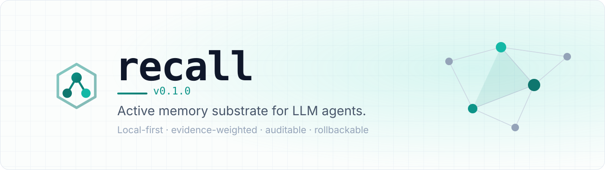
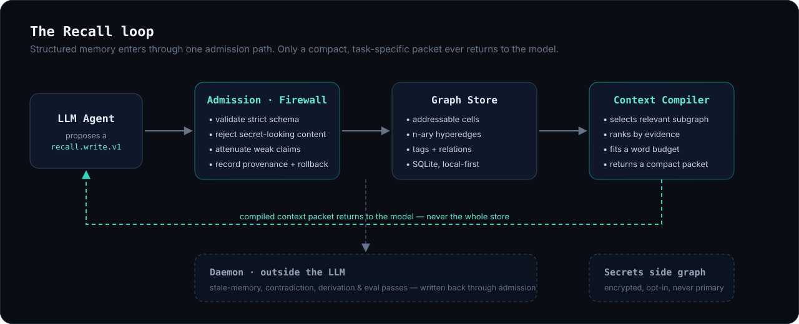

<div align="center">

<picture>
  <source media="(prefers-color-scheme: dark)" srcset=".github/assets/recall-banner-dark.svg">
  <source media="(prefers-color-scheme: light)" srcset=".github/assets/recall-banner-light.svg">
  
</picture>

<br/>
<br/>

**Disciplined, operable memory for LLM agents. Evidence-weighted, auditable, and compiled to a budget instead of poured back into the prompt.**

[](LICENSE)
[](package.json)
[](#development)
[](scripts/e2e.mjs)
[](#why-recall)
[](#project-status)
[](CONTRIBUTING.md)
[](CODE_OF_CONDUCT.md)

[Install](#install) ·
[Quickstart](#the-60-second-tour) ·
[Demo](#demo) ·
[Agents & MCP](#hook-up-your-agent) ·
[How it works](#how-it-works) ·
[Why Recall](#why-recall) ·
[Compare](#how-recall-compares) ·
[Teams](#one-graph-many-writers) ·
[Checker, Solver & Lattice](#beyond-memory-checker-solver-and-lattice) ·
[Docs](docs/README.md) ·
[Roadmap](ROADMAP.md)

</div>

---

**Recall is disciplined, operable memory: a runtime, not a pile of notes.**
Most agent "memory" is chat logs or a vector index that gets poured back
into the prompt. With Recall, an LLM proposes a structured write, an
admission firewall validates it, the graph store persists it as addressable
cells and n-ary hyperedges in local SQLite, and the compiler returns only
the relevant subgraph, ranked by evidence and fit to a word budget. Every
fact carries provenance, confidence, and a rollback entry. You can inspect,
question, and undo anything in it.

One installable Node.js tool: CLI, read-only TUI, MCP server, quiet
maintenance daemon, strict write schema, semantic search, encrypted secrets
side graph, and a reproducible benchmark harness.

## Install

```bash
npm install -g github:H-XX-D/recall-memory-substrate
```

Or use the installer script, which clones, builds, and links `recall` +
`recall-mcp`:

```bash
curl -fsSL https://raw.githubusercontent.com/H-XX-D/recall-memory-substrate/main/scripts/install.sh | bash
```

Requires Node.js 24+. Recall uses Node's built-in SQLite, so there is no
database server, no native build step, no account, and no network
dependency. CI runs the core suite on Linux, macOS, and Windows, plus a
readiness lane for MCP smoke, Python hooks/toolkit checks, public benchmarks,
and installer validation. Upgrades, uninstall, and troubleshooting:
[Installation Guide](docs/11_INSTALLATION.md).

## The 60-second tour

```bash
recall version    # confirm the installed package version
recall init       # create the local graph in ./.recall
recall status     # store health, counts, config
```

Memory enters as structured, schema-validated proposals. Normally your
agent submits these over MCP ([see below](#hook-up-your-agent)), but the
same path works from the shell:

```bash
recall admit --json decision.json   # validated, provenance-stamped, rollbackable
```

It comes back as a compiled context packet, not a dump of the store:

```bash
recall compile "prepare the auth service deploy" --words 220
```

```text
objective:
prepare the auth service deploy

compiler_state:
- retrieval=fts5-bm25; query="prepare the auth service deploy"; selected_cells=3; budget_words=220
- health=beliefs:0, contradictions:0, stale_or_low_trust:0, critical_warnings:0

relevant_memory:
- Cap the Postgres pool at 20 connections: Staging fell over at 35 concurrent
  connections during the load test on June 3. Capped pool_size at 20 in service
  config; raising it requires a load test sign-off. [decision:07fbbfd9-…]

risks:
- Auth tokens expire but never rotate: Access tokens have 24h expiry but no
  rotation path; a leaked token stays valid until expiry. [risk:1cb991a1-…]

tasks:
- Add a smoke check for the new rate limiter: The rate limiter shipped behind a
  flag; nobody has verified the 429 path end to end. [task:8bddbb07-…]

expansion_handles:
- 07fbbfd9-…  1cb991a1-…  8bddbb07-…
```

A packet holds ranked evidence, open risks and tasks, contradiction
warnings when they exist, and expansion handles for drilling into any cell,
all under a hard word budget. You can browse the graph at any time:

```bash
recall tui                          # read-only terminal dashboard
recall search "rate limiter"        # FTS5 + BM25 lexical search
recall semantic "token rotation"    # semantic search (hash or real embeddings)
```

Every cell also carries an **effective confidence** next to the author's
immutable stated confidence. It is recomputed on every read from incoming
supports, challenges, and the writer's contradiction record. Write one
contradiction and the number moves:

```text
# before: the pool-cap decision stands alone
decision:6eba1114…  state=active/conf:0.7/eff:0.7/…

# after: one cell contradicts it (nothing deleted, no model ran)
decision:6eba1114…  state=active/conf:0.7/eff:0.29(challenged)/…
```

Challenged cells sink in ranking, supported cells hold, and writers with a
record of overconfidence get discounted. All of it is deterministic and
runs offline.

Runtime state stays local and is git-ignored by default:

```text
.recall/recall.sqlite3      # primary graph
.recall/secrets.sqlite3     # encrypted secrets side graph
```

Back up or move a graph with the portable archive path:

```bash
recall export > recall-export.json
recall import --json recall-export.json --db .recall/restored.sqlite3
```

Undo a bad write through the rollback journal:

```bash
recall rollback list
recall rollback show <journal-id>
recall rollback apply <journal-id>
```

See [Backup And Recovery](docs/20_BACKUP_AND_RECOVERY.md) for the full
restore path, including file-level SQLite copies and upgrade safety.

## Demo


The demo shows a correction crossing sessions: a first fact is admitted, a later
cell contradicts it, a fresh process compiles the current answer, and a standing
watch program trips when the watched belief is overruled. Reproduce it locally:

```bash
npm run build
./scripts/demo-cross-session.sh
./scripts/demo-raw.sh      # compact receipt with actual CLI output
```

## Hook up your agent

Routine memory is agent-managed through MCP. Users should not have to
hand-save ordinary observations, decisions, risks, or tasks.

```bash
recall mcp config --db .recall/recall.sqlite3   # print an MCP config block
recall-mcp                                       # start the stdio MCP server
```

Paste the config block into any MCP-capable client (Claude Code, desktop
apps, agent runtimes), then add the
[LLM System Prompt](docs/LLM_SYSTEM_PROMPT.md) to your agent's
instructions. The agent's loop becomes: compile, work, write back.

| Tool | Purpose |
|---|---|
| `recall_compile` | Compile a compact context packet for a task. Start here |
| `recall_write` | Submit a strict, evidence-aware memory proposal |
| `recall_search` / `recall_semantic` | Retrieve graph evidence by exact or semantic match |
| `recall_subgraph` | Compose subgraphs from structured tags |
| `recall_daemon_run_once` | Run one outside-the-LLM maintenance pass |

There are 42 MCP tools in total, covering status, hyperedges, programs,
DAGs, evals, ACP agent coordination, and calibration. The
[LLM Integration Guide](docs/LLM_INTEGRATION.md) is the full operating
contract, including the proposal shape.

### The `/recall` command (Claude Code)

The repo ships a Claude Code slash command at
[`.claude/commands/recall.md`](.claude/commands/recall.md). Copy it into your
own project, or make it global, and `/recall` becomes a one-word way to wire a
session to Recall:

```bash
# global (available in every project):
mkdir -p ~/.claude/commands && cp .claude/commands/recall.md ~/.claude/commands/

# or per-project:
cp .claude/commands/recall.md /path/to/your/project/.claude/commands/
```

After the one-time MCP setup above, typing `/recall` resolves your store
(`RECALL_DB` if set, otherwise the local `.recall/recall.sqlite3`), ensures it
exists, compiles a context packet for what you are about to do, and hands the
agent the compile, work, write-back loop. No schema to manage, no setup to
repeat. `/recall <topic>` compiles for that topic; bare `/recall` orients on
recent state. If your memory already lives in a shared or global store, export
`RECALL_DB` so `/recall` targets it instead of minting an empty local db.

### One-command agent integration (Claude Code & Codex)

The MCP-config-and-system-prompt setup above is also available as a single
idempotent command per agent runtime. `scripts/install.sh` runs these
automatically (fail-soft) when the corresponding CLI is present, and you can
re-run them anytime to refresh to the latest bundled version:

```bash
recall claude sync     # Claude Code
recall codex sync      # OpenAI Codex
recall claude status   # report which pieces are installed (codex status likewise)
```

**Claude Code** (`recall claude sync`) installs a SessionStart/UserPromptSubmit
hook that nudges the agent to consult Recall, copies the recall skill into
`~/.claude/skills/`, registers the recall MCP server in `~/.claude.json`, and
sets `CLAUDE_CODE_DISABLE_AUTO_MEMORY=1` so Recall is the durable memory layer
instead of Claude Code's built-in note memory (keep native auto-memory with
`RECALL_KEEP_AUTOMEMORY=1`; revert with `recall claude enable-auto-memory`).

**Codex** (`recall codex sync`) copies the recall skill into
`~/.codex/skills/`, registers the recall MCP server under `[mcp_servers.recall]`
in `~/.codex/config.toml`, and injects a marker-delimited Recall directive into
`~/.codex/AGENTS.md` — Codex's always-read global instructions, the analog of
Claude Code's SessionStart hook. Codex exposes no native-memory kill switch, so
Recall is positioned as the durable memory layer at the prompt level via that
directive. All edits are backed up before write, preserve your existing config,
and are idempotent.

## How it works

<div align="center">

</div>

1. **Propose.** The LLM submits a `recall.write.v1` proposal with content,
   evidence, confidence, provenance, and structured tags.
2. **Admit.** Admission validates the schema, applies firewall checks,
   attenuates unsupported claims, warns on near-duplicates, blocks
   secret-looking content, and journals a rollback entry.
3. **Store.** Memory persists as addressable cells and n-ary hyperedges in
   SQLite, reachable by address, tag, relation, or semantic search.
4. **Compile.** The compiler builds a compact, task-specific packet under a
   word budget, listing each cell's challengers alongside it and computing
   each cell's effective confidence from the live graph.
5. **Maintain.** A quiet daemon runs stale-memory, contradiction,
   derivation, and eval passes outside the LLM, writing back through the
   same admission path as everyone else.

The base structure is a hypernetwork. DAGs are optional overlays for
ordered workflows, evidence chains, and execution traces.

Hyperedges can also carry programs: declared, versioned, sandboxed
operations (`recall.program.v1`) that run on demand. Bind a decision to its
risks and verifications and the bundle can score itself. Because the score
reads live effective confidence, it works as a tripwire:

```text
recall program run <program-id>     # Friday deploy gate
  → averageEffectiveConfidence: 0.7, score: 0.827

# new evidence contradicts the load-test verification

recall program run <program-id>     # same gate, no model ran
  → averageEffectiveConfidence: 0.322, score: 0.638

recall program run <program-id> --derive
  → derives a witness cell, filed through the same admission gate as any
    other write
```

Other memory systems store relations as passive records that only an
external model can act on. Here, a deploy gate's score falls on its own
when any member is contradicted, whether by a teammate, another agent, or
a failing test wired in through `test-contradicts` edges. See
[Advanced Graph Operations](docs/06_ADVANCED_GRAPH_OPERATIONS.md).

The `watch` operation turns a bundle into a standing reflex. It baselines
against its own previous run (run history is the state, so no extra
machinery is needed), trips when the bundle's live effective confidence
moves more than `delta`, and derives nothing otherwise. A quiet watch
means the value was checked and had not moved.

```text
recall program add <hyperedge-id> --json watch.json
  # { "schemaVersion": "recall.program.v1", "operation": "watch",
  #   "params": { "delta": 0.15, "concernTarget": "<decision-cell-id>" } }

recall program run <program-id> --derive
  → untripped: derives nothing
  → tripped:   files a concern against the target decision, through the
               same admission gate as every other write, attributed to
               program:<id>
```

A tripped watch does not modify its target. It files a concern through
admission like any other writer, which means reflexes carry `produced_by`
and accumulate a calibration record. A watcher whose concerns keep getting
refuted gets discounted by the same loop that scores humans and LLMs.
Watches can chain: a verification collapses, its watcher files a concern
on the decision built on it, that decision's effective confidence falls,
and a watcher on the decision can fire next. Run a watch from cron and a
standing decision becomes a monitored service.

Two more operations round out the set:

- `drift` is watch with attribution. A tripped run names which member
  moved (`topMover`, plus a ranked `movers` list), so you can see what
  caused a gate to fall.
- `quorum` is k-of-m sign-off as a graph object. A member counts as an
  approval when its live effective confidence clears `minEff`, counted
  across distinct actors so one writer cannot stack the gate. If an
  approver's cell is later contradicted, its effective confidence drops
  and the approval stops counting, with no policy code involved. Quorum
  runs always derive their attestation.

Compile packets carry a `standing_programs` section listing the gates,
watches, and quorums covering each returned cell, with program and bundle
handles, so an agent writing new evidence can tie it into the existing
bundle instead of orphaning it. Deeper concepts live in the
[docs](docs/README.md): the [write schema](docs/02_WRITE_SCHEMA.md),
[tagging & subgraphs](docs/03_TAGGING_AND_SUBGRAPHS.md), the
[context compiler](docs/04_CONTEXT_COMPILER.md), and
[cells & graph views](docs/14_ADDRESSABLE_CELLS_AND_GRAPH_VIEWS.md).

### Inception: grounded synthesis

`recall incept` is an experimental primitive for synthesis rather than
retrieval. It compiles a slice of the graph for an open objective, then emits
a write-back template whose `depends_on` is pre-populated with the slice's
cell ids. A model fills in the synthesis (a method, a connection, an insight
implied by a contradiction between cells) and admits it. Because the template
is pre-grounded, any cell created this way is born linked to the sources it was
synthesized from.

The generative step stays in the model on purpose. Recall gathers the slice,
guarantees the grounding, and admits the result, but it does not synthesize,
because putting a model in the runtime would break the no-model trust loop. The
new cell lands as a `hypothesis` at conservative confidence, marked unverified,
so it enters the graph and earns or loses trust over time through the same
effective-confidence machinery as any other write. The model synthesizes,
Recall grounds it and lets the graph vet it.

```bash
recall incept "novel approaches given what we know about X and Y"
```

## Why Recall

Recall makes a few opinionated bets that most memory layers don't:

| | Most memory layers | **Recall** |
|---|---|---|
| **Trust model** | Append text, trust later | Every write passes an admission firewall: schema-validated, provenance-stamped, rollbackable |
| **What returns to the model** | The whole store, or a top-k blob | A compiled context packet: the relevant subgraph, ranked by evidence, fit to a word budget |
| **Structure** | Flat notes or a single knowledge graph | Addressable cells plus n-ary hyperedges, with optional DAG overlays for ordered work |
| **Where it lives** | A cloud service you send data to | Local-first. SQLite on your machine. No account, no network required |
| **Secrets** | Mixed into the same store | A separate encrypted side graph, opt-in, never in the primary graph |
| **Mistakes** | Overwrite and move on | Rollback instead of overwrite: supersede by relation, keep the audit trail |
| **Maintenance** | Manual curation, or none | A quiet daemon runs stale-memory, contradiction, and derivation passes outside the LLM |
| **Calibration** | Confidence is decoration | Closed-loop calibration: each actor's stated confidence is scored against survived contradictions |
| **Confidence** | A static number typed once | A living number: effective confidence is recomputed from supports, challenges, and the writer's track record on every read, with no LLM in the loop |

The common thread is auditability: provenance on every cell, a firewall on
every write, and a packet you can actually read.

## How Recall compares

The main design split in agent memory is how trust changes when new
information arrives. The field has three mechanisms:

| Mechanism | Who uses it | What happens to a contested claim |
|---|---|---|
| A model decides | mem0, Zep, Letta, Hindsight | An LLM resolves the conflict at ingest, invalidates the fact, or rewrites beliefs. Opaque, non-reproducible, and the losing claim is often deleted |
| The clock decides | decay-based systems | Importance fades on a forgetting curve whether or not any evidence arrived |
| The evidence decides | **Recall** | Effective confidence is recomputed from typed supports, challenges, and the writer's contradiction record. Same graph, same number, every time |

Other systems ask a model what to believe. Recall computes it.

The rest are architectural design properties, not benchmark claims. Pick
the tool that matches how much you care about auditability and local
control.

| Property | Vector RAG | Knowledge-graph memory | Cloud memory APIs | **Recall** |
|---|:---:|:---:|:---:|:---:|
| Runs fully local, no account | sometimes | sometimes | ✗ | ✅ |
| Structured write schema enforced | ✗ | partial | varies | ✅ |
| Admission firewall on every write | ✗ | ✗ | varies | ✅ |
| Provenance + rollback per write | ✗ | partial | varies | ✅ |
| N-ary hyperedges (not just pairwise) | ✗ | rare | ✗ | ✅ |
| Word-budgeted compiled context | ✗ | ✗ | partial | ✅ |
| Encrypted, segregated secrets store | ✗ | ✗ | varies | ✅ |
| Single runtime, one memory API | ✗ | varies | n/a | ✅ |
| Trust evolves with no LLM in the loop | ✗ | ✗ | ✗ | ✅ |
| Tiered reads over trust-annotated claims (title → peek → full cell) | ✗ | partial | partial | ✅ |

Tiered, agent-navigated retrieval is an emerging pattern across the field.
Letta pages between memory tiers, and progressive-disclosure indexes are
appearing elsewhere. Recall's difference is what sits at each tier: not
auto-summaries of activity, but gate-vetted claims carrying live trust
state, addressed in the same namespace the evidence machinery uses. The
index layer tells the agent where digging is warranted, not just that it
may dig.

Recall trades turnkey cloud convenience for local control and an audit
trail. If you want a hosted, batteries-included memory service, projects
like mem0, Letta, and Zep are excellent. Recall is the other kind of tool:
the graph lives on your disk, every write comes with a receipt, and
nothing in it is above being challenged.

## One graph, many writers

Most memory layers assume one user and one assistant. Recall's write path
was built for traffic. Humans, agents, CI jobs, the daemon, and tripped
reflexes all write through the same admission gate, so every cell lands
schema-checked, attributed, timestamped, and rollbackable no matter who
sent it. That is what makes a single project graph safe to share: when a
decision changes overnight, a teammate does not ask around in chat, they
compile. The packet says who changed it, when, on what evidence, and what
it contradicts. Run `recall compile "what changed since Friday"` on Monday
morning and the briefing writes itself.

The gate is also vendor-blind. A proposal from GPT, Claude, Gemini, or a
local model is the same `recall.write.v1` JSON, judged by the same rules,
landing in the same graph. Calibration then scores every writer
separately, human or model, on one ledger. Route work to whichever model
is cheap this month, and let track records rather than logos decide how
much to trust what comes back.

It is tier-blind for the same reason. The write contract asks for
discipline, not brilliance, so a small model can hold the same memory
standards as a frontier one. And because the compile packet carries the
team's accumulated judgment, including the calls, the risks, and the open
contradictions, a cheap model starts its session with the same briefing an
expensive one gets. The packet does the remembering so the model does not
have to.

Standing programs turn the shared graph into something a team can watch
without opening a terminal. The fully actuated setup puts the store on a
box everyone can reach and lets the tripwires do the talking. Point the
whole team at one graph by setting `RECALL_DB` once on the host: the CLI,
the MCP server, and the helper scripts all read it, so agents, cron jobs,
and exporters route to the same store with no per-command flag (pass
`--db` when you want to override it). Then let a scheduler run each
standing gate on a heartbeat. Every program run prints plain JSON, so it
wires into whatever the room already watches with no integration to
install:

```bash
export RECALL_DB=/srv/recall/payments.sqlite3   # one graph, whole team

# cron, every 10 min: trip the deploy gate, ping the channel
recall program run <watch-id> --derive \
  | jq -e '.run.output.tripped' >/dev/null &&
  curl -s -X POST "$SLACK_WEBHOOK" -H 'content-type: application/json' \
    -d '{"text":"Deploy gate tripped: the load-test verification moved."}'

# run history is a time series of gate scores (createdAt + output.current).
# An exporter scrapes it into Prometheus/Grafana, where alerting fires when
# a gate's effective confidence crosses your threshold.
recall program runs --limit 200
```

A panel of gate scores is the project's live status, read straight off the
trust graph: each score is its bundle's effective confidence, so the board
shows at a glance what is currently believed, what is contested, and what
just moved. The tripped run has already filed its concern in the graph
through admission, so Slack and Grafana are only the echo into the room,
not the source of truth.

One caveat, stated plainly: today "shared" means the writers are processes
on that one host. Team SSH sessions, CI jobs, agents running there, and the
cron watchers all hit the same store over SQLite WAL, which handles the
concurrency. Putting the file on a network share for many separate machines
to write is not safe, by SQLite's own guidance. One graph served over HTTP
with authenticated actor identity, so remote machines write without sharing
the host, is next on the [roadmap](ROADMAP.md).

## Beyond memory: Checker, Solver, and Lattice

Recall is the memory layer of a four-part system. The other three parts
plug into the same graph through the same admission gate.

**Checker** is the verification layer, built on one rule: absence of
refutation is not verification. It runs declared checks and stores honest
verdicts (`verified` / `refuted` / `unverifiable` / `error` / `partial`)
in a ledger, and its attestation is git-native: `verify-commit` refuses
dirty trees and non-HEAD SHAs, `gate --ref` answers whether a specific
commit is verified, and a fail-closed pre-push hook gates pushes on that
answer. Checker emits typed `checker-supports` and `checker-contradicts`
edges into the Recall graph, where they already count for more than peer
testimony in effective confidence, and compile packets surface checker
challenges on every affected cell. Verification is tied to an exact
commit on a clean tree, not to a claim that the tests passed at some
point.

**Solver** is the compute layer: a library of 96 small, fast, gated
solvers spanning control theory, signal processing, estimation, and
optimization. Kalman filtering, FIR/biquad, CORDIC, Goertzel, count-min
sketches, matrix-free conjugate gradient, and an Ising/simulated-annealing
tier that makes QUBO formulations practical where hand-rolled heuristics
used to be the only affordable option. The CPU tier is plain C, the GPU
tier is CUDA, and every solver is validated against a reference oracle
before any speed number is trusted. Each solver carries an optimality
contract declaring what class of claim its answers make: exact,
tolerance-bounded, or heuristic. Results land in Recall as addressable,
priced claims. The division of labor: the model formulates, Lattice maps
the code, Solver computes, Recall remembers, Checker attests.

**Lattice** is the code-analysis layer, and the one part that is an
enterprise capability rather than open source: access-gated, vetted, and
not bundled in the OSS distribution. It ingests a codebase over the
Language Server Protocol into the same typed hypernetwork Recall uses —
symbols, modules, and the import, call, and reference edges between them —
then runs structural analyses over that graph. `impact` returns a change's
reverse-reachability blast radius *before* you edit; `hunt` ranks
structural bugs, including cross-signal findings no single diagnostic
shows, like an exported path that reaches unimplemented code; `diagnose`
surfaces cycles, dead code, stubs, and coupling hotspots in one pass;
`plan` lays out the ordered, verify-gated steps to land a change; and
`verify` is a differential gate that reports only the structural
regressions a change *caused*, measured against a git ref in a throwaway
worktree. A gated security-audit mode maps attack surface and
source-to-sink reachability for authorized review of your own code. Every
finding carries the same explicit `verified` / `not_verified` contract
Checker enforces: reachability tells you where to look, never that a bug
is proven.

What sets it apart is where the findings go. Lattice grounds everything it
computes: the hard combinatorial step — the minimum feedback arc set that
breaks a dependency cycle — routes to Solver's gated QUBO tier and is
verified locally before it is trusted, and results land in Recall as
addressable, evidence-weighted cells through the same admission gate as
every other write. A structural regression stops being a console warning
that scrolls away and becomes a cell with provenance that a deploy gate
can score and a teammate can compile tomorrow. It ships an MCP server
built for the agent edit loop — ask `impact` before an edit, gate with
`hunt` after — served in milliseconds off a graph ingested once and
cached.

Together they cover memory, verification, computation, and code structure
behind one write path, with no model in the loop.

**Checker org capabilities, Solver access, and Lattice (enterprise):**
[todd@hendrixxdesign.com](mailto:todd@hendrixxdesign.com)

## CLI cheat sheet

```bash
# inspect
recall version
recall status
recall tui [--watch]

# retrieve
recall search "query"
recall semantic "query"
recall subgraph --project Recall --category memory --subject compiler
recall compile "task description" --words 900
recall incept "open objective"        # compile a slice into a grounded synthesis template

# write (agent/debug path; normal memory flows through MCP recall_write)
recall validate --json proposal.json
recall admit    --json proposal.json

# backup / restore
recall export > recall-export.json
recall import --json recall-export.json --db .recall/restored.sqlite3

# undo
recall rollback list
recall rollback show <journal-id>
recall rollback apply <journal-id>

# advanced graph runtime
recall hyperedge add --json hyperedge.json
recall program add <hyperedge-id> --json program.json
recall dag analyze <overlay-id> --derive
recall eval run --derive
recall operate once --derive

# health & trust
recall beliefs
recall calibration
recall maintenance --derive

# daemon
recall daemon run-once [--derive]
recall daemon run --interval-ms 60000

# secrets (encrypted side graph, explicit confirmation required)
printf 'password\nsecret-value' | recall secrets save \
  --title "service token" --confirm-secret-save --password-stdin --value-stdin
```

Run `recall help` for the full command surface, or see the
[CLI & TUI reference](docs/05_CLI_TUI.md).

## Benchmarks

Recall ships a reproducible public benchmark: a synthetic corpus in a
throwaway database, measuring latency and throughput across the
operational surfaces (`admit_write`, `search`, `semantic`, `compile`,
paging, daemon and operator passes, secrets):

```bash
npm run bench:public
```

Numbers vary by machine. The point is that anyone can rerun the
measurement. See [Public Benchmark](docs/19_PUBLIC_BENCHMARK.md) for
methodology.

## Documentation

Start with the [docs index](docs/README.md), which routes by purpose and
by audience. Highlights:

- [Installation Guide](docs/11_INSTALLATION.md)
- [Architecture](docs/01_ARCHITECTURE.md)
- [Strict Write Schema](docs/02_WRITE_SCHEMA.md), the `recall.write.v1` contract
- [Context Compiler](docs/04_CONTEXT_COMPILER.md)
- [LLM Integration Guide](docs/LLM_INTEGRATION.md) · [LLM System Prompt](docs/LLM_SYSTEM_PROMPT.md)
- [Secrets Side Graph](docs/12_SECRETS_SIDE_GRAPH.md)
- [Daemon, MCP & Semantic Search](docs/13_DAEMON_MCP_SEMANTIC_SUBGRAPHS.md)
- [Public Benchmark](docs/19_PUBLIC_BENCHMARK.md)
- [Backup And Recovery](docs/20_BACKUP_AND_RECOVERY.md)

## Development

```bash
npm install
npm run build     # tsc
npm test          # 138 unit/integration tests
npm run e2e       # 94 end-to-end checks across user + agent workflows
npm run smoke     # init + status on a throwaway db
npm run smoke:mcp # stdio MCP initialize + tools/list smoke
npm run test:python
npm run verify:full
```

Contributions are welcome. See [CONTRIBUTING.md](CONTRIBUTING.md) and the
[Code of Conduct](CODE_OF_CONDUCT.md). Keep changes schema-first, small,
tested, and aligned with the single-runtime architecture. A good first PR
runs `npm test && npm run e2e` clean; release-readiness changes should run
`npm run verify:full`. The [Roadmap](ROADMAP.md) lays out
direction by ring: Foundation, Runtime, and Interfaces. Working in this
repo with an AI agent? Point it at [AGENTS.md](AGENTS.md).

## Security

Read [SECURITY.md](SECURITY.md) before using Recall with sensitive data.
Important defaults:

- runtime databases and logs are git-ignored
- primary-graph writes flag and reject common secret-looking content (a
  high-recall heuristic backstop, not a guarantee — real secrets belong in the
  encrypted side graph)
- encrypted secret saves require explicit confirmation
- primary-graph writes are schema-validated and rollbackable

Report vulnerabilities via GitHub Security Advisories. See the policy for
details.

## Project status

Recall is an early working runtime foundation. It is suitable for local
experimentation and integration work, and it does not claim
production-grade or state-of-the-art behavior without external benchmarks
and deployment review. Interfaces may change before a stable release.
Treat compiled context packets as evidence, not unquestionable truth,
which is how Recall is designed to be used anyway.

## Citation

If Recall helps your work, please cite it. See [CITATION.cff](CITATION.cff)
or use GitHub's "Cite this repository" button.

## License

Recall is licensed under the [Apache License 2.0](LICENSE). See
[NOTICE](NOTICE).

<div align="center">
<br/>
<sub>Built for agents that should <strong>remember responsibly</strong>.</sub>
</div>
