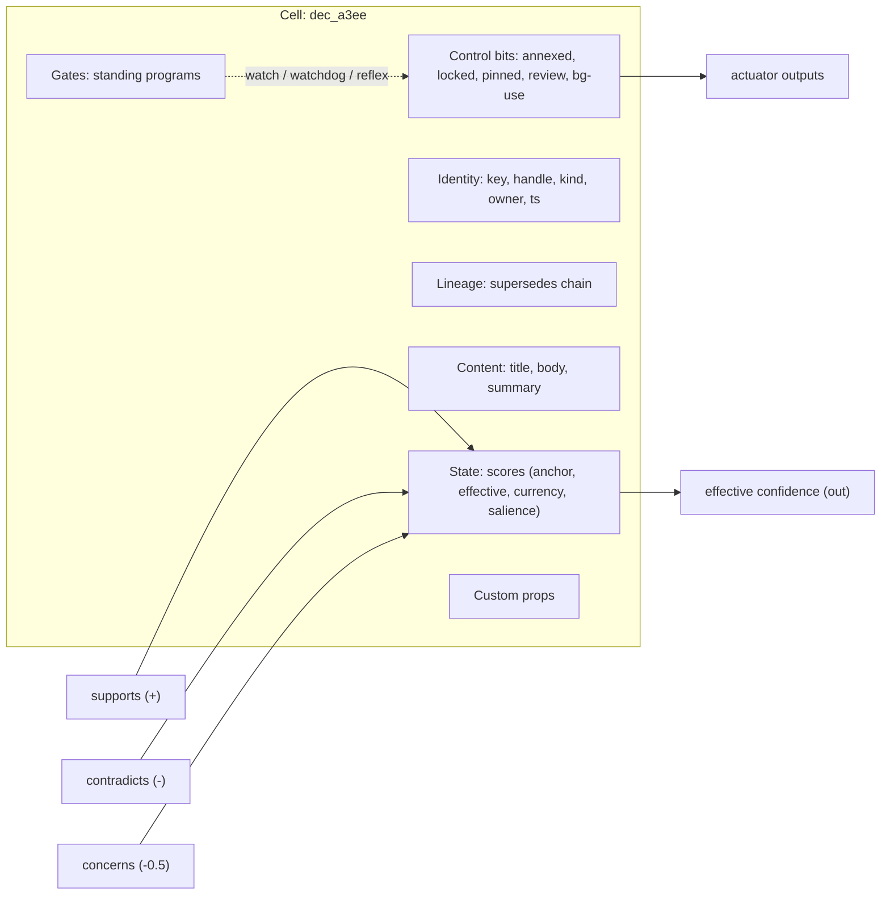
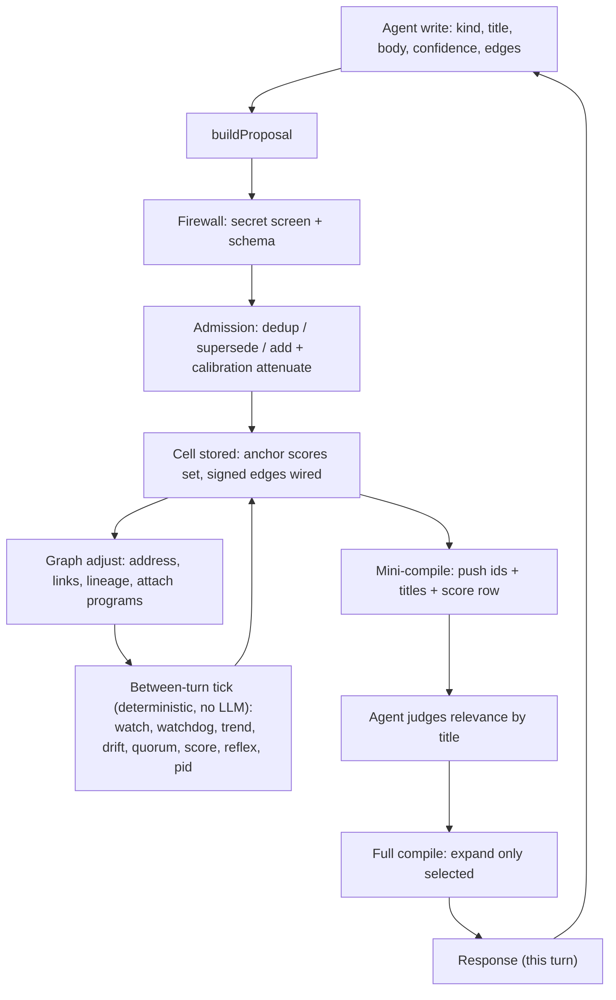

# Recall v5 / MAL: complete design (for review)

Assembled 2026-06-23 for printing. Source of record is docs/PLAN.md + docs/design/*;
edit those, not this concatenation. Reading order:

1. System + language (mal-language)
2. The cell (cell-anatomy)
3. The scores (write-time-scores)
4. Between-turn signals catalog
5. The plan of record (all decisions)
6. First program / source analysis (R0-foundation)


---

<!-- ===== design/mal-language.md ===== -->

# MAL: the Memory Abstraction Layer, system and language

Date: 2026-06-23
Status: DECIDED

MAL is HAL (LinuxCNC's Hardware Abstraction Layer) one layer up, over a memory
graph instead of hardware. This doc is the system overview plus the language:
the lexicon (the words) and the grammar (the sentences).

## 1. The system

| HAL | MAL |
|-----|-----|
| pin | a cell field |
| signal | an addressable value; a derived field has one owning op (tick determinism) |
| component | an op (watch / watchdog / trend / drift / quorum / score / reflex / smooth / clamp / latch / route / fanout / snapshot / record / replay / pid / oneshot) |
| thread | the operator tick (between turns) |
| net (the wire) | the dotted address |
| netlist (the .hal file) | the memory netlist |

Trust premise: MANY WRITERS, ONE READER. Many actors write claims/edges/supersessions
to a cell; the calibration + effective math reconcile them for the one agent reading
the compiled slice. (This is the inverse of HAL's one-writer-many-readers, and it is
why effective != stated: the value is the reconciliation of many fallible writers.)
A derived field is still single-op-owned, but only for tick determinism; its inputs
are the many writers' contributions.

Deterministic: every op is pure math, no LLM. The model only states a claim + a
calibrated confidence + the edges it intends; MAL computes scores, currency,
salience, and the 34 between-turn signals on the tick. The model reads back a lean
slice (mini-index then expand). Per-turn protocol: PUSH, EXPAND, WORK, WRITE-BACK,
TICK (START primes once per session).

## 2. The lexicon (the words)

- Handle: `kind_hex` (snake_case 3-letter kind prefix + short hex), e.g. `dec_a3ee`.
  CAPS = an IMMUTABLE cell (`RECALL_v5`); lowercase = mutable.
- Separators by binding tightness: `_` joins words in one name; `-` walks a field
  within a cell (`dec_a3ee-scores-eff`); `.` crosses an edge to a neighbor
  (`dec_a3ee.supports`), so periods count graph hops.
- Values: `field(value)`. `!` inside marks an IMMUTABLE number (`conf(.7!)`); bare
  is mutable. Types: float (scores), bit (actuators).
- Version: `@vN` (a point on the supersede chain). Wildcard: `.*` fans out over all
  neighbors via an edge (`dec_a3ee.supports.*`).
- `^` (leading) = EXPAND REQUIRED in the mini-index: the cell is
  superseded/stale/challenged, the model must expand it before use (`^dec_a3ee ...`).

## 3. The grammar (the sentences)

Modeled on HAL's `halcmd` syntax.

THE RULE: tokens are separated by a single SPACE; the signal/name comes FIRST;
connections follow. Direction uses `<` / `>` and is MEANINGFUL: `a > b` is the
directed edge a->b (a DAG connection), `a < b` is b->a. (This is where MAL departs
from HAL: HAL ignores its arrows because dataflow direction is implicit in
writer/reader; MAL edges are semantic and directional, so direction is real.)

EXCEPTION: a `"..."` quoted string is ONE token, exempt from space-separation. It
may contain spaces, commas, anything, used for free text (titles, body).

COMMENT: `#` to end of line.

Sentence forms:

| form | shape | example |
|------|-------|---------|
| wire (net) | `net <signal> <target> <input> ...` | `net eff dec_a3ee < conf calib supports.* contradicts.*` |
| set (setp) | `<addr> = <value>` (or `setp <addr> <value>`) | `dec_a3ee-flags-annexed = true` |
| schedule (addf) | `addf <op> tick` | `addf contradiction-load tick` |
| edge | `<source> <relation>> <target> (<weight>)` (`>` fwd, `<` rev) | `dec_a3ee supports> dec_signals_a2b7 (+.6)` |
| render (read) | `<handle> "<title>" <field(value)>... <relation>-><target>(<w>)...` | see below |

Conditions and thresholds are op PARAMETERS, not syntax: set them with `setp`
(`setp watch.thresh 0.6`), exactly as HAL sets a component's parameter.

## 4. Worked example (a netlist snippet)

```
# a cell, rendered (read form): handle, title, scores, then edges
dec_a3ee "add watchdog op" conf(.7!) unc(.10) eff(.61) curr(.9) sal(.5) annexed(0) pinned(0)
  supports> dec_signals_a2b7(+.6)  contradicts> obs_9c1f(-.8)

# wire the effective-confidence signal on it (write form)
net eff dec_a3ee < conf calib supports.* contradicts.*

# declare an edge (direction: > forward a->b, < reverse)
dec_a3ee supports> dec_signals_a2b7 (+.6)

# fire an actuator
dec_a3ee-flags-annexed = true

# schedule a between-turn signal onto the tick
addf contradiction-load tick
```

## 5. The boundary (what the language does NOT do)

The language WIRES ops; it does not DEFINE their math. The formulas (`eff =
clamp01(stated*calib + support - challenge)`, the per-type currency decay, the
allocation pressure formula) live INSIDE the ops, like a HAL component's math lives
in compiled C, not in the `.hal` file. The grammar only connects pre-built ops.

The single op configurable without code is `reflex`/`lut5`: a user sets its
behavior with a personality (`setp reflex.personality 0x...`), a truth table, not a
formula. So user-configurable boolean logic needs no expression language.

[DEFERRED] an inline-formula form (HAL's separate `comp` tool equivalent) for
defining new op math in the language. Not needed for v0: the fixed op palette plus
the configurable reflex cover the cases.

## See also
- `docs/PLAN.md` (Items 4, 9, 10)
- `docs/design/cell-anatomy.md`, `write-time-scores.md`, `signals-catalog.md`


---

<!-- ===== design/cell-anatomy.md ===== -->

# Recall v5 cell anatomy

Date: 2026-06-23
Status: DECIDED (Item 3)

## The decision

The v5 cell is the current cell's contents, reorganized. The two things the whole
system computes on, the edges and the scores, live today inside an untyped
`data: Record<string, unknown>` bag. v5 lifts them out into typed first-class
primitives. `type` is collapsed into `kind` (one memory class). Nothing essential
is invented; the important parts are un-hidden.

## Field set (component view)

A cell is a component (LinuxCNC HAL lens): identity + content + pins + state +
control bits + attached gates.

| Group | Fields | Type | Notes |
|-------|--------|------|-------|
| Identity | key, handle, kind, owner, timestamp | id / string | stable hex key + typed handle (`dec_a3ee`); owner promoted from provenance |
| Lineage | supersedes chain / status | edges | first-class version chain; resolve to live head |
| Content | title, body, summary | text | |
| Pins | signed edges (supports +, contradicts -, concerns -0.5), depends_on | edge (float weight) | the value-bearing relations, out of the bag |
| State | scores: stated-anchor, effective, currency, salience | float block | one ordered, addressable legend (see write-time-scores.md) |
| Control bits | annexed, locked, pinned, requires_review, allow_background_use | bit | the actuators |
| Gates | attached standing programs | ref | programs watching this cell |
| Custom | typed properties bag | mixed | the rest of `data`, but typed |
| Scope | project, tenant | string | also the residency key |

Dropped: the long `cellAddress` path (the hex handle replaces it), the separate
`type` tag (folded into `kind`), likely `signature_status`.

## The cell as a component



## Lifecycle: how a value moves through a cell



## Why this shape

- Edges and scores are first-class, so the deterministic op layer (watch /
  watchdog / trend / reflex / pid / ...) reads and writes them directly, by
  address `(cell.field)`, instead of digging through an untyped bag.
- The model sets only the stated-anchor leaf values; every derived value
  (effective, currency, salience, the edge masses) is deterministic math over
  those leaves. Subjectivity is confined to the leaves.
- Supersession lineage and annex (a control bit) replace delete and rollback:
  nothing is destroyed, the live value is resolved through the chain.

## See also

- `docs/PLAN.md` (Items 3, 4, 5, 10)
- `docs/design/write-time-scores.md` (the ordered scores legend)
- `docs/subsystems/R0-foundation.md` (the current code this rewrites)


---

<!-- ===== design/write-time-scores.md ===== -->

# Cell scores: stated vs effective, and the graph's relational math

What numeric values a cell carries, which are the model's retained anchors versus
values the graph attenuates or derives, and where the leverage is. Grounded in the
prior three-axis decay decisions, the prior call that effective confidence is
recomputed from the graph (not a fixed field), and the calibration anti-drift rule.

## 1. The two numbers

Every cell has two headline numbers:

- Model-proposed: what the model claims. Retained as an anchor: never overwritten,
  but not frozen as the working value either.
- Effective: the proposed number attenuated against the graph and the actor's
  calibration. Alive, recomputed.

Nothing is frozen. The working number is attenuated, not fixed. What we keep is the
model's original proposed number as a non-drifting anchor, and every attenuation is
computed from that anchor, not from the last attenuated value, so repeated
attenuation does not compound and drift. We keep the model's own calibration signal
for exactly this reason. This was already established.

## 2. Where the leverage is: relation to what is already there

When you state something, the graph evaluates it relative to existing cells. That
relation is where most of the math comes from:

- Corroboration: supporting neighbors raise the effective value.
- Contradiction pressure: contradicting neighbors lower it, or demote it versus
  the incumbent depending on the actors' calibration.
- Isolation / novelty: no neighbors means higher uncertainty.
- Redundancy: a near-duplicate is merged rather than double-counted.

None of this needs to be frozen at write. It is a function of position in the
graph, so it is naturally recomputed, at write as a cached snapshot and at read
when freshness matters.

## 3. The three axes (prior, resolved)

- Evidence: how well-supported the claim is. Stated confidence lives here and
  stays evidence-only. Time does not change it.
- Currency: staleness. `c(t) = c_floor + (c0 - c_floor) * e^(-lambda * dt)`,
  per-type lambda (stable 3650 days, volatile 30, ephemeral 7), reinforcement
  resets dt. Separate ranking surface, never merged into confidence.
- Salience: importance. Seeded, reinforced by use, decays.

## 4. The ordered legend (the canonical Y set)

Position is meaning, so `(X, Y)` = `(cell hex id, index)` addresses any value
without storing labels on every cell. The "immutable" column is the only hard
line; "recompute" is where the value is naturally produced, not a rule.

| Y | name | axis | immutable input or graph-derived | recompute | notes |
|---|------|------|----------------------------------|-----------|-------|
| 0 | confidence (proposed) | evidence | model input, required, (0,1] | retained anchor | the model's number; kept un-overwritten to prevent drift |
| 1 | uncertainty | evidence | immutable if stated, else derived | write | default `(1 - confidence) * 0.7` |
| 2 | concern | evidence | immutable if stated, else derived | write | default `(1 - confidence) * 0.3` |
| 3 | stability | evidence/currency | immutable input | never | selects the currency lambda class |
| 4 | source_quality | evidence | graph-derived (from stated) | write | label from confidence |
| 5 | actor_calibration | evidence | graph-derived (actor history) | read/tick | the writer's stated-vs-outcome multiplier |
| 6 | effective_confidence | evidence | graph-derived (relational) | read | the second headline number: stated, reconciled against the graph |
| 7 | evidence_balance | evidence | graph-derived (relational) | read | from supports/contradicts/concerns neighbors |
| 8 | currency | currency | derived (time) | read | `c(t)`; stored inputs are c0, lambda class, last_reinforced |
| 9 | salience | salience | derived (use) | read | seeded then reinforced by access/citation |

Nothing here is frozen. Y0 and Y3 are retained anchors (never overwritten); the
rest the graph produces or attenuates, at whatever time is cheapest, from the
cell's relations and the actor's calibration.

## 5. The boolean actuators (flags)

Booleans ride in the same ordered block after the numbers. They gate effect
rather than measure it.

| B | name | effect | default |
|---|------|--------|---------|
| 0 | annexed | effect neutralized, cell retained and reinstatable (replaces delete and rollback) | false |
| 1 | locked | immutability lock: no supersede, no annex | false |
| 2 | requires_review | held for review before background use | false |
| 3 | allow_background_use | programs and compile may use without prompting | true |
| 4 | pinned | exempt from currency decay, always retrievable | false |

Annex is the rollback replacement: flip `annexed = true` and the cell stops
affecting scores, retrieval, and relation resolution, but stays in the store and
can be reinstated.

## 6. Calibration and anti-drift

Calibration compares the model's proposed number (Y0, the retained anchor) against
what later happened to the cell (contradicted, superseded, or held). The actor's
track record over many cells is `actor_calibration` (Y5), which attenuates the
effective number (Y6) for their future writes. Keeping Y0 un-overwritten is what
prevents drift: attenuation is always taken from the anchor, never re-applied to an
already-attenuated value, so it does not compound. We keep the model's own
calibration signal for this reason. Established earlier, restated here.

## 7. Addressing: (X, Y)

- X = the cell, by short hex id. The id is the handle, no long path address.
- Y = a field. For scores, Y is the index in section 4. For structural fields
  (title, body, summary, kind, owner, timestamp), Y is the field name.

`(a3ee009, 0)` is that cell's stated confidence; `(a3ee009, 6)` is its effective
confidence; `(a3ee009, body)` is its content.

## 8. Open decisions

- Confirm the legend membership and order (sections 4 and 5).
- evidence_balance and effective_confidence formulas: how corroboration and
  contradiction pressure combine into the effective number.
- Whether to cache a write-time snapshot of the graph-derived values for cheap
  reads, and how stale that snapshot is allowed to get before a recompute.
- salience seeding and reinforcement rule.
- currency c_floor, and whether pinned cells skip currency entirely.


---

<!-- ===== design/signals-catalog.md ===== -->

# Recall v5 / MAL: between-turn signals catalog

Date: 2026-06-23
Status: DECIDED (Item 8). 30 per-cell signals + 5 meta-signals.

A signal is a cheap, deterministic metric the operator computes between turns from
cell scores + signed edges, wired from the op palette, that drives a between-turn
action. No LLM, one or two hops, single-writer.

Tag on each: **[silent]** acts only between turns (re-rank / demote / annex / pin /
reinforce / gate) and never enters the model's context; **[surfaced]** raises a
compact flag the model sees next turn. Keeping most signals silent is what holds
the compiled packet lean (see the model-load decision).

---

## Evidence axis

- **contradiction-load-ratio** [high, silent] — signed pressure `S_neg/(S_neg+S_pos)` in [0,1]; >0.6 = held up mostly by what fights it. Wiring: score the signed masses, clamp, smooth(EMA .3), watch(>.6). Acts: demote eff by (1-ratio), annex to a "disputed" shelf so it never surfaces alone.
- **contradiction-acceleration (flip-imminent)** [high, surfaced] — 2nd finite-diff of incoming contradicts count; distinguishes a collapsing claim from a settled dispute. Wiring: record(4)+trend+trend, clamp, watch(accel>=+2). Acts: pre-emptively gate it from being cited as a premise, queue for adjudication.
- **effective-momentum (signed eff slope)** [high, silent] — `EMA(eff_t - eff_{t-1})`, keeps sign vs the unsigned volatility. Wiring: record+trend+smooth+clamp. Acts: rising → reinforce salience; falling → demote, annotate "eroding".
- **confabulation-volatility-spike** [high, silent] — large |Deff| while the edge set is unchanged = a value moving with no evidence. Wiring: trend(eff) + drift(edge-set hash) + reflex AND. Acts: freeze eff at pre-jump value (clamp slew 0), flag for review, block propagation.
- **corroboration-independence-index** [high, surfaced] — effective number of INDEPENDENT supporters (provenance roots, overlap-discounted); 10 restatements of one source ~ 1. Wiring: fanout supports → derived_from roots, score with 1/(1+overlap), watch(<2). Acts: cap support mass at independent count, tag "single-source echo", seek an independent source.
- **checkpoint-freshness** [medium, surfaced] — `cp_eff * e^(-age/tau)`, zeroed if contradicted after verification. Wiring: snapshot(cp_time) + watchdog + watch(contradicts after cp). Acts: downgrade done→needs-review, stop counting toward burn-down.

## Structural axis

- **isolation-vs-anchor** [high, surfaced] — high-conf cell with ~0 signed degree = an orphan/unfalsifiable assertion. Wiring: score degree + reflex(lut5 over deg/conf/currency/immutable). Acts: route to needs-grounding, apply a volatile-currency penalty so it decays unless grounded.
- **cut-criticality / bridge** [high, silent] — share of neighbors that reach the graph only through this cell (single point of failure). Wiring: 2-hop score + latch(orphaned-if-removed) + funnel term, quorum. Acts: pin currency so the lone bridge does not age out, mark non-evictable, solicit a redundant edge.
- **local-cluster-density (echo index)** [medium, silent] — local clustering coefficient; high = echo pocket, low-at-high-degree = real bridge. Wiring: triangle count over 2-hop, drift vs global mean. Acts: echo pocket → down-weight intra-cluster support; bridge → reinforce/pin.
- **dangling-supersession (annex-without-heir)** [medium, surfaced] — superseded_by target gone/annexed, leaving a dead terminal still retrieved. Wiring: watchdog on superseded_by target + reflex + oneshot. Acts: queue for re-anchor, gate from authoritative service until reanchored.
- **orphan-drift** [medium, surfaced] — live-degree falling over a window as neighbors get annexed, before true degree-0. Wiring: record(live-degree) + trend + watchdog(deg→1, slope<0). Acts: alert and annex for re-linking before it rots unseen.

## Currency axis

- **supersession-depth + staleness gradient** [medium, surfaced] — bounded walk (MAXHOP 6) of the chain behind a cell, weighted by worst currency along it. Wiring: trend walks supersedes chain, track min currency, watchdog(>.6). Acts: alert "rests on aged base", re-verify the root, demote deep chains.
- **currency-half-life ETA (time-to-stale)** [high, surfaced] — closed-form `days_to_stale` until currency hits 0.5. Wiring: score from (currency, tau-by-class, floor), siggen recompute, watch(<=7). Acts: latch into a refresh queue BEFORE decay bites.
- **staleness-under-demand** [high, surfaced] — high salience + old CONTENT-touch (retrieval-touch masks stale content). Wiring: separate content_touched ts, watchdog(content_age), watch(salience>median), reflex AND, oneshot. Acts: one-shot re-verify so the system stops serving stale-but-popular memory confidently.
- **staleness-divergence (vs neighborhood)** [medium, silent] — `currency_self - EMA(supporters' currency)`; forgotten cell vs whole-cluster aging. Wiring: fanout supporters + smooth + drift, watch(<=-.3). Acts: targeted refresh bumped ahead; cluster-wide aging → one batched alert.

## Salience axis

- **demand-acceleration** [high, silent] — 2nd-diff of retrieval salience; heating vs plateaued vs cooling. Wiring: record(16)+trend+trend+smooth, watch(+/-.05). Acts: re-rank — pre-warm rising cells into the working set before they fully heat.
- **citation-in-degree-momentum** [medium, silent] — rate of new distinct inbound edges (anti-echo normalized) = a node becoming load-bearing. Wiring: score inbound edges 1/(#from same producer), trend, watch(>.3 & in>=4). Acts: bump currency tau one tier, pin into the candidate set.
- **supply-demand-gap** [medium, surfaced] — per topic: queried a lot, thin high-quality evidence. Wiring: smooth(demand) vs score(supply), subtract, watchdog(>.4 for 3 ticks). Acts: surface an "evidence is thin here" caveat, gate auto-confident answers.
- **attention-monopoly** [low, silent] — one cell hogging a topic's hits while siblings starve. Wiring: score(max/total salience), drift, watch(>.6). Acts: down-weight the dominant, lift two siblings into view.
- **query-cluster-coherence** [low, silent] — recent hits tight (focused) vs scattered (exploratory). Wiring: record(12) + quorum(3-of-12 within 1 hop), route. Acts: high → narrow retrieval (deeper); low → widen fan-out (broader).

## Task axis

- **ready-gate (blocked-vs-ready)** [high, silent] — 1 = all depends_on done and none blocked. Wiring: quorum over prereq done-bits + watchdog(any prereq eff<.2) + reflex AND, latch. Acts: admit to ready queue; flips exactly when the last blocker clears.
- **dependency-rot** [high, surfaced] — a depends_on target annexed, superseded-without-heir, OR eff-collapsed. Wiring: watchdog + drift(prereq eff vs attach snapshot) + reflex OR + latch + route(offending addr). Acts: pull from ready queue, surface "dependency rotted: <addr>".
- **objective burn-down (velocity + ETA)** [medium, surfaced] — `burn_rate` of children-done + `eta_ticks`. Wiring: score done-count + trend + reciprocal, watchdog(rate<eps while open). Acts: stalled → raise in status digest with ETA; healthy → demote.
- **task-staleness + risk-aging** [medium, surfaced] — monotonic clocks: open-task aging pressure, and `concern*age*(1-mitigation)`. Wiring: watchdog(tau) + clamp + reflex(gate to open); risk: score(coverage)*age. Acts: stale tasks bubble up the ready-sort; hot risk forced into context, gates a parent's done-transition.
- **allocation-pressure** [high, surfaced] — which open work to do next, folding in the proven workflow formula verbatim: `pressure = impact * (uncertainty + concern + novelty) * (0.5 + dependency) * (0.5 + reversibility/2) / cost`. Value terms ADD (one being 0 doesn't kill it), structural terms are floored multipliers, cost divides. Wiring: score over a task's fields — uncertainty/concern from the cell, dependency = depends_on in-degree, impact/cost/novelty/reversibility = task fields or derived (novelty ~ isolation, reversibility ~ policy). Acts: the ready-queue sort key; high pressure surfaces first. The workflow primitives (work_candidate/allocation_plan/proxy_score/miss) stay deferred; only this math folds in. `triage-rank` (meta) reuses this multiplicative shape for retrieval ordering.

## Actor axis

- **calibration-weighted authority skew** [high, silent] — signed EMA of `stated_conf - realized_eff` per actor (a LEVEL). Wiring: score bias per resolved claim + smooth(.1) + clamp. Acts: subtract the bias at intake so an overconfident actor's new writes auto-deflate (calibration self-corrects between turns).
- **calibration-drift (residual slope)** [medium, silent] — signed rate of an actor's reliability change (early-warning derivative). Wiring: score residual + record(20) + trend, watch(<-.15). Acts: scale calibration factor down 0.85 on a falling source, relax back up on recovery.
- **cross-actor agreement (concordance)** [medium, surfaced] — per claim k-of-m author sign agreement; per actor concordance vs majority. Wiring: quorum over authors' signs + score concordance + drift. Acts: agreement<.34 annex as contested; concordance falling flags actor, raises concern, does NOT auto-demote (contrarians can be right).
- **provenance-diversity trend** [medium, surfaced] — distinct-source count growing or shrinking (collapse onto one source). Wiring: score distinct producers + record(15) + trend, watch(slope<0 & D<=2). Acts: raise uncertainty, emit a task to seek a corroborating source.
- **actor specialization (topic concentration)** [low, silent] — Herfindahl of eff-weighted contributions over topics + best-topic. Wiring: fanout authored→topics, score per bucket, reduce H, route argmax. Acts: specialist prior in-domain, generalist haircut out-of-domain.

---

## Meta-signals (the completeness layer over the 29)

The completeness pass flagged that 29 per-cell signals each drive their own re-rank
or actuator and can fight each other, and that nothing audits the operators or the
graph globally. Five meta-signals close that:

- **triage-rank** [high, silent] — ONE fused priority per cell: weighted combine of
  effective-momentum, contradiction-load, currency-ETA, and salience into a single
  retrieval/attention order. Wiring: score(weighted sum of the named signals) +
  clamp. Acts: the single sort key compile/retrieval uses, so the operator applies
  ONE ordering instead of N re-ranks that conflict.
- **actuator-arbitration** [high, silent] — detects two programs latching opposing
  actuators on one cell (pin vs compact, reinforce vs freeze) and resolves by fixed
  precedence (freeze/safety > pin > demote > reinforce). Wiring: reflex(lut5 over
  the conflicting bits) → one resolved action + watch(conflict) to audit. Acts:
  deterministic precedence; logs conflicts for tuning.
- **compaction-pressure** [high, silent] — graph-global `node/edge count vs capacity`
  scalar in [0,1] that gates how hard eviction/annex fire this tick (every per-cell
  signal assumes unbounded room). Wiring: global score(counts vs cap) + smooth.
  Acts: clamps the annex/evict rate by pressure — aggressive when full, conservative
  when roomy.
- **reflex-meta-calibration** [medium, surfaced] — audits the operators, not the
  cells: per reflex, `overridden trips / total trips`. Wiring: score(override rate)
  + watch(high). Acts: flag a mis-firing reflex personality for re-tuning or disable
  it. Calibration for the programs themselves.
- **edge mis-wiring** [medium, silent] — flags a likely-wrong edge (a supports edge
  between cells that mostly contradict their shared neighbors) before one bad edge
  poisons load-ratio, independence, and bridge scores at once. Wiring: score(edge
  sign vs neighborhood consensus) + watch(low). Acts: down-weight/quarantine the
  suspect edge pending review.

---

## Merged / dropped (11)

volatility-regime-latch → confab-spike; source-independence/collusion → corroboration-independence; contradiction-onset → contradiction-acceleration; betweenness-proxy → cut-criticality (funnel term); reinforcement-rate → currency-ETA; touch-recency slope → demand-acceleration; dispute-quorum-stall → load-ratio + watchdog; actor-silence → staleness-divergence + currency; hub-imbalance → cluster-density + independence; orphan-demand → citation-momentum + demand-accel. Full reasons in the workflow output.

## Surfacing summary

Of 34 signals, ~13 are **[surfaced]** (they raise a compact flag the model reads
next turn: disputes, flip-imminent, single-source, stale, dependency-rot, contested,
thin-evidence, stalled-objective, hot-risk, reflex-misfire). The rest are **[silent]**
(re-rank, pin, reinforce, gate, arbitrate between turns). The model never sees the
math, only the handful of flags, which is what keeps its load flat as the catalog
grows.

## See also
- `docs/PLAN.md` Items 8 and 10
- `docs/design/write-time-scores.md`, `docs/design/cell-anatomy.md`


---

<!-- ===== PLAN.md ===== -->

# Recall v5: the plan of record

A living document. We walk it top to bottom, lock open items as we go, and I keep
it updated each turn. Nothing here is code; it is the design we agree on before
any building starts.

Detail docs this plan points at:
- Spec: `docs/superpowers/specs/2026-06-23-recall-v5-ground-up-rewrite-design.md`
- First program: `docs/subsystems/R0-foundation.md`
- Scores model: `docs/design/write-time-scores.md`

Legend: [DECIDED] settled. [OPEN] needs your call. [WIP] in progress. [LATER] parked.

## The architecture: MAL (Memory Abstraction Layer)

v5 IS the Memory Abstraction Layer, the direct analogue of LinuxCNC's HAL (Hardware
Abstraction Layer): MAL abstracts the memory store the way HAL abstracts hardware.
One-to-one mapping: cell fields = pins; addressable values = signals (one writer,
many readers); ops (watch/watchdog/trend/drift/quorum/score/reflex/pid/...) =
components; the operator tick = the thread (HAL `addf` scheduling); the dotted
address = the wire; a MAL graph rendered as text = a memory netlist, legible by
sight. Everything below is MAL's design.

---

## 0. Where we are in the walkthrough

DESIGN COMPLETE. BUILD STARTED, fresh, no port from the clone. R0 Foundation is
sealed on `rewrite/integration`; R1 Gate is hardened on `rewrite/integration`.
Secret side store first slice is implemented: encrypted project-DB blobs, boring
aliases, and a key-provider seam for later OS/OEM keychain auth. R2 Store core
slice is implemented: normalized SQLite cells/edges, store-backed FTS5/BM25
lexical retrieval with LIKE fallback, compile delegation, evidence mass walks,
and store stats. R4 Compile core slice is implemented: ID-first context packets,
sectioned mini-index push, incoming challenge surfacing, expansion handles,
packet formatting, and lazy cell/field inspection. R5 Routing core slice is
implemented: central Recall home/project registry routing, deepest-ancestor cwd
resolution, slug collision hardening, local graph discovery, and a read-only
federated Store union with graph-prefixed keys/edges. R7 Integrations core slice
is implemented: platform-neutral Recall directives, Store-backed prompt context
pushes, stop write-back reminders, Codex AGENTS/slash/MCP TOML merge helpers,
and Claude settings/MCP merge helpers with auto-memory disabling. R8 Surfaces
core slice is implemented: public ESM export barrel, `recall-mal` npm bin,
project/status/read CLI commands, validate/admit write commands, executable
build output, and runtime-only package file selection. R9 Python core helper
slice is implemented: `recall_helper.py` builds compact v5 write proposals and
delegates validate/admit to `recall-mal`, `recall_peek.py` renders compact cell
previews from `recall-mal cell show`, Python helpers are included in npm package
files, and `npm run test:python` covers build/validate/admit/peek. R3
Programs/Operator core slice is implemented: `prg` cells carry
`recall.program.v1` specs, the operator cycle ticks active cells and runs
standing programs, program witnesses re-enter through admission when `--derive`
is set, and `recall-mal operate once` exposes the cycle. R6 Adapters core slice
is implemented: dry-run-first import core, Mem0/Zep/auto-memory JSON/markdown
adapters, source fingerprints/source-tag supersession through R1/R2 admission,
portable `recall.cells.export.v1` archives, and CLI `export`/`import` commands.
Current full verification: 158 TypeScript tests + 5 Python tests green; typecheck
clean, build clean, CLI smoke clean, npm pack dry-run clean.

---

## 1. Project frame and workflow  [DECIDED]

- Ground-up redesign. Behavior and APIs may change. Old tests are reference only.
- Unit of work: one subsystem per cycle.
- Target: build v5 fresh in `~/Recallv.5` (local git, no remote).
- Source: `~/Recall-GitHub-Clean`, read-only reference, ported from.
- Burn the clone down: each ported subsystem is deleted from the clone on a
  `rewrite/burndown` branch; clone empty equals done.
- Branches in v5: `main` <- `rewrite/integration` <- `rewrite/<subsystem>` worktrees;
  one final merge to `main`.
- Recall stays in the loop: compile intent before each subsystem, write decisions
  and risks back as we go.

## 2. Scope: drop / defer / keep  [REVISED 2026-06-23 in your walkthrough]

Drop (cut entirely):
- ACP.
- `RollbackEntry` (replaced by annex).

Defer (add back after a stable core):
- MCP server and the launch-agent / service ("the servers").
- TUI.
- legacy global-to-local local-import and richer service import surfaces.
- eval / benchmark (might come in handy later).

Keep (the core):
- R0 Foundation (slimmed).
- R1 Gate: firewall + admission + calibration + secret/public-data screening +
  encrypted secret side store.
- R2 Store: store + FTS5 retrieval + evidence.
- R3: programs + daemon + scheduler + operator (full, not a minimal tick) +
  workflow-allocate (mine its ideas).
- R4 compile + cell-context.
- R5 routing (residency).
- R8 CLI.
- claude-integration (the hooks).
- R6 adapters: import core, portable cell archives, auto-memory, mem0, and zep.
- codex-integration.
- DAG homology / holonomy (both kept, per the prior correction that the
  hypernetwork allows both on its members).

Open (resolve before R-order):
- zep adapter: [decided/core implemented] keep alongside mem0 for JSON export import.
- DAG overlay analysis (heads-up: the holonomy witnesses are computed by it, so
  keeping holonomy probably means keeping this).
- semantic / vector embeddings (deferred beyond the current R2 core slice).
- pages views (named report views; deferred beyond the current R4 core slice).

Secrets (decided, first slice implemented): the stable-core gate rejects
recognized secret values and blocks likely personal data on public writes. Secret
values that must be retained go into the project SQLite DB as AES-256-GCM blobs
under boring aliases like `sec_4f2a19c8d031`; normal cells reference aliases only.
Decryption is routed through a `SecretKeyProvider` seam so the later macOS/OEM
keychain adapter can unwrap project keys without changing the DB contract.
Deferred: keychain adapter, lock/unlock CLI, cross-platform providers, and the
Total-Recall hardened alias/metadata policy.

## 3. The cell anatomy  [DECIDED, component view]

The v5 cell = the current cell's contents with edges and scores lifted out of the
untyped `data` bag into typed first-class primitives. `type` is folded into `kind`
(one memory class). Field groups (component / HAL lens):

- Identity: key (stable hex), handle (typed, item 4), kind, owner, timestamp.
- Lineage: supersedes chain (first-class), resolve to live head.
- Content: title, body, summary.
- Pins (wiring): signed edges (supports +, contradicts -, concerns -0.5),
  depends_on; incoming = input pins, outgoing = output pins.
- State: the ordered scores block (stated anchor + effective + three axes).
- Control bits (actuators): annexed, locked, pinned, requires_review,
  allow_background_use.
- Attached gates: the standing programs watching this cell.
- Custom: typed properties bag.
- Scope: project / tenant (also the residency key).

Dropped: long cellAddress path (hex handle replaces it), `type` tag (folded into
kind), likely signature_status. Full design + 2 flowcharts:
docs/design/cell-anatomy.md.

## 4. IDs and addressing  [DECIDED]

Two layers (proposed):
- Stable internal KEY (the database identifier): opaque, fixed, never changes.
  Every relation foreign-keys to this. Fixed width.
- Semantic HANDLE: human-readable snake_case, encodes what the cell is (typed
  prefix + facets), re-derivable, variable length. Bare cell short (`dec_a3ee`);
  rich cell longer (`dec_auth_a3ee`). Tuple internally `{kind, facets[], seq}`,
  string for display.
- Addressing is a variable-length PATH, not a fixed grid (the graph is a ragged
  table, cells have different columns). It grows three ways: deeper into a cell
  (`-` field walk), wider across cells (`.` edge hop), and back in time (`@vN`).
  Compose freely, e.g. `dec_a3ee@v2.supports-weight`.
- Separators (final), by binding tightness: `_` joins words in a name (snake_case
  identifier), `-` walks fields within a cell, `.` crosses an edge to another cell.
  Periods count graph hops: `dec_a3ee-scores-eff` (in-cell, 0 hops),
  `dec_a3ee.supports-eff` (1 hop), `dec_a3ee.supports.contradicts-title` (2 hops).
  Edges branch (sets/vectors); outgoing default, incoming via `~`. The address is
  the op wire (HAL `net`).

Why separate: a content-encoding id cannot be the relation target, because when
content changes the id would change and break every edge. Encode meaning in the
handle, keep the key stable.

Emergent property (legibility): because the notation is regular and ops are
single-writer-deterministic, the graph's text form is readable by sight, a "memory
netlist" (a MAL graph rendered as text; netlist is the EDA/HAL term). You read the
memory instead of querying it: `conf(0.7!) eff(0.42) curr(0.9)`, follow `.supports`,
done. Auditable by eye = the static counterpart to the scope.

Core pattern (recurring): immutable anchor + live resolution. Same move as
effective confidence and currency. Relations use it too (see below).

[DECIDED] relations RESOLVE through the supersession/annex chain: edges are
immutable and directed; a change supersedes (writes a new cell); the live target
is resolved at read by walking the chain. Backtracking = reading the edge in
reverse (incoming index), no mutation, no sign needed for direction.

Write cases (firewall decides): exact repeat -> dedup (no new cell); same subject
+ changed claim -> supersede (new head, old kept); novel -> plain add (no chain).
"I like banana" then "I like orange" = add, not supersede. Version depth is
COUNTED from the chain, not stored. A fork (two cells supersede one) resolves to a
single live head by recency/calibration. Transitive relatedness (hand-leg) is
DERIVED from path weight decayed per hop, never materialized. Rule: store direct
immutable edges only; resolve the live target, version depth, and relatedness from
paths. Spin-off signal: proximity score = best-path weight decayed by hops.

[DECIDED] edge weight is SIGNED (polarity): supports +, contradicts -, concerns
-0.5. Edges are value-bearing. Effective math becomes one signed sum, but
saturation stays SPLIT BY SIGN (positive capped ~0.15, negative ~0.6) so one
contradiction still outweighs many supports. Supersede forks resolve to the live
head by CALIBRATION, not recency.

[DECIDED] handle = `kind_hex` (snake_case): 3-letter kind prefix + short hex
(4 chars, git-style, grows on collision), e.g. `dec_a3ee`, `obs_7f1c`, `rsk_9b20`;
rich cells add a subject facet `dec_auth_a3ee`.
[DECIDED] notation (HAL-derived, extended for the graph): lowercase + digits;
type-tagged (float = scores, bit = actuators); abbreviation when unambiguous; soft
length cap (HAL = 41). THREE separators by binding tightness: `_` joins words in
one name/identifier (tightest, snake_case), `-` walks fields within a cell, `.`
crosses an edge to another cell (loosest) so periods count graph hops; plus `@vN`
for a version. Examples: `dec_auth_a3ee` (handle), `dec_a3ee-scores-eff` (float),
`dec_a3ee-flags-annexed` (bit), `dec_a3ee.supports-eff` (1 hop). CASE: a
CAPITALIZED handle marks an IMMUTABLE cell (`RECALL_v5`), a constant/anchor whose
contents never mutate in place (revise only by supersession; exempt from decay);
lowercase = ordinary mutable cell. For NUMBERS: a value attaches to its figure in
parens, `field(value)` (e.g. `eff(0.42)`); the immutable ones carry `!` inside the
parens, `field(value!)` (e.g. `conf(0.7!)` anchor, `c_floor(0.1!)` constant). So
the immutability markers are: CAPS for names, `!` inside parens for numbers.

[DECIDED 2026-06-26] prefix set is `dec`, `obs`, `bel`, `tsk`, `obj`, `rsk`,
`ref`, `ver`, `hyp`, `prg`. Handle suffix is 4 lowercase hex chars, git-style;
rich handles may add subject facets before the suffix. Soft length cap is 41.

## 5. The scores model  [DECIDED]

- Two headline numbers: model-proposed (a retained anchor, never overwritten) and
  effective (attenuated from the anchor, recomputed). Nothing is frozen.
- Anti-drift: attenuation is always taken from the anchor, never re-applied to an
  already-attenuated value, so it cannot compound. We keep the model's own number
  for exactly this.
- Three separate axes: evidence (confidence), currency (staleness), salience
  (importance). Time is not evidence.
- Why model-set values are OK (and the honest limit): every value is the writer
  model's call at write, grounded in its comprehension of what it ingested. But
  the next-turn reader is closer to FRESH than continuous, so the comprehension
  does NOT persist; only the value does. Calibration (retained anchor + Brier
  track-record) is what lets a fresh reader trust a value whose reasoning is gone.
  It BOUNDS the model's subjectivity over time; it does not erase it. A
  persistently miscalibrated writer still sets biased anchors; the graph's job is
  to SURFACE that (contradiction / drift / low calibration factor), not hide it.

[DECIDED] ordered legend (position = meaning; evidence -> currency -> salience;
anchor before derived; floats then bits so the push row is contiguous):
floats `0 confidence(stated anchor) 1 uncertainty 2 concern 3 source_quality
4 actor_calibration 5 effective 6 currency_c0 7 currency 8 salience_seed 9 salience`;
bits `10 annexed 11 locked 12 pinned 13 requires_review 14 allow_background_use`.
stability = enum input selecting the currency time-constant. Calibration reads 0..5.
Notation: values attach to their figure in parens `field(value)`; the immutable
ones (pos-0 anchor and config constants) carry `!` inside, e.g. `conf(0.7!)`,
`c_floor(0.1!)`; derived/live values (effective, currency, salience, masses) have
no `!`.

[DECIDED] salience = a leaky accumulator of USES: seed 0.5 at write, bump on each
retrieval into a compile packet (`s += (1-s)*k`), leak toward a floor on idle
ticks. Distinct from currency: currency resets on any TOUCH/update (freshness),
salience grows on USE/retrieval (demand). Currency = how fresh, salience = how
wanted.

## 6. The math  [GROUNDED in code]

- Effective confidence (real, `evidence.ts`):
  `effective = clamp01(stated x calibrationFactor + support - challenge)`,
  `support = 0.15 x tanh(supportMass)`, `challenge = 0.6 x tanh(challengeMass)`,
  masses summed over one hop of incoming trust edges weighted by each neighbor's
  stated confidence. The "K-mass / K-function": linear mass into a tanh saturation
  with asymmetric ceilings. One hop, deterministic, no LLM. v5: edges hold signed
  weight, so support - challenge collapses to one signed sum
  `Σ signed_edge_weight x neighbor_confidence`; saturation stays split by sign to
  keep the asymmetry (one challenger sinks it).
- Calibration (real, `calibration.ts`): per-actor Brier score of stated confidence
  vs survived-contradiction outcome, turned into `calibrationFactor` floored at
  0.5, neutral under 3 cells.
- Currency: the per-type lambda decay `c(t) = c_floor + (c0 - c_floor) e^(-lambda dt)`
  (stable 3650 / volatile 30 / ephemeral 7) is a DECISION but is NOT in either
  tree's code (both still carry a single 30-day recency half-life, no commit for
  the per-type work). v5 rebuilds it fresh from the decision.

[DECIDED] currency params (commenter's formula, de5b7ec3): `currency(dt) = c_floor
+ (c0 - c_floor)*e^(-dt/tau)`, dt resets on any reinforcement; tau per stability =
stable 3650d / volatile 30d / ephemeral 7d; c0 = 1.0; c_floor = 0.1 (tunable).
Separate ranking surface, never merged into confidence. Pinned cells skip currency
(held at c0).

## 7. Value-bearing primitives  [OPEN, new]

Today only cells hold values. Make more primitives value-bearing:
- Edge / relation [DECIDED]: SIGNED weight (supports +, contradicts -, concerns
  -0.5). Value-bearing. Mass = `Σ signed_edge_weight x neighbor_confidence`,
  saturation split by sign.
- Tags (topics / entities): per-topic salience, per-entity weight.
- Actor / identity: standing calibration, trust, topic specialization.
- Hyperedge member: use the existing optional weight.
- Hyperedge / program: a rolling value the program holds.

[DECIDED] edges done (signed); ACTORS next (store the standing calibration factor
+ trust on the actor, addressable `actor_calibration`; effective already needs it).
Tags (per-entity/topic salience) layer on after cell salience works. Hyperedge
member weights used as programs need them. Program rolling-values come with the op
layer (item 10). So: actors now, the rest layer on.

## 8. Between-turn signals catalog  [DECIDED]

30 per-cell signals across 6 lenses (evidence / structural / currency / salience /
task / actor incl. allocation-pressure folding in the workflow pressure formula) +
5 meta-signals (triage-rank, actuator-arbitration,
compaction-pressure, reflex-meta-calibration, edge-mis-wiring) that close the
completeness gaps; 11 candidates merged/dropped. Each is a deterministic MAL wiring
driving a between-turn action. ~13 are [surfaced] (raise a compact flag the model
reads next turn); the rest are [silent] (re-rank / pin / reinforce / gate), which is
what keeps the compiled packet lean. Full catalog: docs/design/signals-catalog.md.

## 9. Session lifecycle: the three hooks  [DECIDED]

Three arming points that make the model USE the substrate. START fires once per
session; COMPILE + ENDCAP fire every turn; the Endcap tick feeds the next Compile.

1. START (`SessionStart`) -- orient + arm on the right graph.
   - Residency: filesystem-presence walk, cwd up to the first `.recall` db elects
     the local graph; none -> global/home. Not a registry (f5c83089).
   - Arm/orient: inject the MAL protocol + a boot digest (activity since last
     session, objectives, open tasks, contradiction/stale counts, standing programs).
   - Catch-up tick so scores/currency/signals reflect elapsed time.
   Goal: the model starts situated on the right graph, not cold.

2. COMPILE (`UserPromptSubmit`) -- push the lean relevant slice.
   - MINI index (8d70f7d9): ids + titles + tripwire counts (challenged/stale +
     surfaced-signal flags) for cells relevant to THIS prompt; deliberately
     INCOMPLETE, fail-open, ~0.16s. NOT the full digest.
   - Two-stage: mini push -> model judges by title -> full compile expands only the
     chosen. Raise EXPAND REQUIRED on relevant superseded/stale cells.
   - Arm against the ask-the-user bypass (make digging the path of least resistance).
   Goal: minimal trust-weighted slice that says what's relevant and what to expand.

3. ENDCAP (`Stop`) -- commit + reconcile + tick.
   - FORCE write-back through the firewall: new cells + intended edges + anchor
     values; firewall = secret-screen, schema, calibration attenuation,
     dedup/supersede/add, unprompted contradiction detection. Forced so the turn is
     captured even if the model didn't explicitly write.
   - Graph adjust: fill addresses/handles, place links, update lineage.
   - Operator tick: recompute scores, decay currency, update salience, run the 34
     signals + standing programs + meta-signals (triage-rank, arbitration,
     compaction-pressure), apply actuators (annex/demote/pin/reinforce).
   Goal: durably capture the turn and bring MAL current for the next Compile.

Theme: the hooks counter the three bypasses -- cold-start amnesia (Start), ignoring
memory (Compile), forgetting to write (Endcap). Arming = the most-missed moat.

Per-turn protocol (5 steps; START primes once per session):
0. START [session, once]: residency + orient + catch-up.
1. PUSH [system->model, injected on the prompt]: the mini-index (ids+titles+tripwire counts).
2. VERIFY [model]: expand the addresses pulled, read the actual cells, clear EXPAND-REQUIRED (do NOT trust titles).
3. WORK [model]: reason, act, answer.
4. WRITE-BACK [Stop, forced]: commit new cells + intended edges + anchors through the firewall.
5. TICK [system-only]: operator pass -- scores/currency/salience + signals + standing programs + graph-adjust; feeds the next PUSH.
The model participates in 1-4; step 5 is silent deterministic system. The VERIFY
step is why the mini-index is deliberately incomplete: titles say what exists, the
model must expand to read actuals.

Compile structure (v5, re-architected for the new cell/address). The address now
self-describes (handle = kind prefix + facets + CAPS-immutability; values written
`field(value!)`), so the compile renders a dense, self-describing NETLIST, not the
old verbose digest. This heavily rewrites R4 (context-compiler); it reads off R0's
address scheme, so build R0 first (it must nail handle parsing + `field(value!)`
rendering), then R4 renders over it. Does NOT block starting R0.
- Mini-index line: `<handle> "<title>" <score-sig> [<flags> <degree>]`, e.g.
  `^dec_watchdog_42c6 "add watchdog op" conf(.7!) eff(.61) curr(.9) [in:1 out:1]`
  (leading `^` = EXPAND REQUIRED, the compact glyph replacing verbose [challenged]).
  Line = TITLE (variable, lint-bounded <=20w) + ~12w of meta. Only the META
  compressed (old line was title + ~40w of state/facets/policy); the title is
  unchanged. Content lives on the cell: title/summary in the line, BODY only on
  expand (never in the push). Handle = kind prefix + subject slug + hex; it is NOT
  the title. Push size ~= N-selected * (short title + ~12w), so keeping titles
  short (the firewall lint) is what keeps the push lean.
- Expand (VERIFY): full cell = ordered scores block + edges as TRAVERSABLE neighbor
  handles (`.supports -> [obs_7f1c]`) + lineage (`@vN`) + body; the model digs by
  following `.edge`. The address IS the navigation.
- Compile = select relevant -> emit handles -> expand on demand. A netlist renderer,
  not a curated prose string.

## 10. Standing programs (the moat)  [LATER]

Programs that run outside the loop: watch / trend / drift / quorum / score. They
read the values from items 5 to 8 and act (re-rank, flag, demote, annex, reinforce,
alert). This is the treasure; design after the basics are solid.

### Op palette (mined from 45 LinuxCNC HAL man pages)

Core (have): `watch` `trend` `drift` `quorum` `score` + the anchor accumulator
`weighted-sum` (= signed-edge mass).

Adopt (the 5 capability classes the core lacks):
- `reflex` (lut5) [high]: configurable 5-input truth table -> bit; subsumes
  and2/or2/xor2/logic/match8. Declarative per-cell boolean policy set by a
  "personality" (HAL `logic`'s term, better than "hex mask"): one configured
  component, not a farm of wired gates.
- `smooth` (lowpass) [high]: EMA a score toward live evidence, damp noise.
- `clamp` (limit2) [high]: bound a score + cap per-tick slew (anti-whiplash).
- `latch` (flipflop) [high]: hold a bit across turns; set/reset overrides.
- `watchdog` (watchdog) [high]: the ABSENCE/timeout tripwire -- fire when a
  monitored value STOPS updating within a timeout (vs `watch` = presence/threshold
  cross). Staleness trip, program-liveness, dependency-silence. Absence-detection
  is a push-only capability a pull store structurally cannot do.
- `route` (mux_generic) [med]: select which evidence feeds the next op, debounced.
- `fanout` (demux) [med]: 1-of-N actuator dispatch, or bargraph = severity ladder.
- `snapshot` (sample_hold) [med]: pin a score as a baseline for drift to diff.
- `record`/`replay` (sampler/streamer) [med/low]: ring-buffer history + re-inject
  to regression-test a reflex.
- `pid` (pid) [high]: a full P+I+D controller driving a value to a setpoint; the
  precise-movement primitive (regulate packet size to a token budget, salience to a
  normalized total, contradiction-rate to a target).
- `oneshot` (oneshot) [med]: fire once for a fixed duration on a trigger edge (alert
  once, not every tick); complements `latch` (holds until cleared).
- `toggle`, `blend` [low].

Folded in as op CONFIG (not new ops): weighted_sum/sum2 = mass anchor; integ/time
= trend/currency accumulator; lowpass->0 = currency decay; edge+debounce =
contradiction-velocity trigger + hysteresis; comp/wcomp = banded watch; near =
pairwise quorum; deadzone = drift noise-gate; abs/scale = score pre-steps; logic =
wide quorum.

Headline: 45 components collapse to ~12 new ops because reflex + route subsume
whole gate/mux families. New classes: routing, value-filter/bound, held-state,
configurable reflex, record/replay, set-point control (pid).

DETERMINISTIC: every op is pure math, no LLM. Same inputs -> same outputs, so the
whole between-turn layer is reproducible, testable (record/replay regression), and
explainable. Model subjectivity is confined to the LEAF anchor values; all
propagation, derivation, and reflexes are deterministic over those leaves. The
reliability floor is fixed by math; the capability ceiling rises with the model.

SIGNALS: a signal is a named, typed (float/bit), addressable value carrier (the
address IS the signal name). Recall is MANY WRITERS, ONE READER: many actors write
claims/edges/supersessions to a cell, and the calibration + effective math reconcile
them for the one reading agent (the trust premise; inverse of HAL's
one-writer-many-readers, because Recall reconciles fallible writers). DERIVED fields
(eff/curr/sal) are single-op-owned only for tick determinism, but their INPUTS are
the many writers' contributions, so that does not contradict many-writers.
Persistent signals = cell fields (stored); transient signals = op-to-op wires; the
operator runs ops in scheduled order each tick (HAL `addf`).

Authoring & tooling:
- `halcmd` -> op-wiring CLI: net (signed edge, fan-out), setp (config / force a
  bit), addf (schedule an op on the tick), show/save (serialize + rehydrate the
  whole op-wired graph for backup/diff).
- ClassicLadder -> visual LADDER AUTHORING of multi-rung reflex policies [LATER]:
  contacts = truth-bits / score thresholds, coils = actuators / op triggers,
  timer/counter blocks = trend/currency/debounce. The config UX over reflex/latch;
  lut5 is one gate, ladder is a program.
- `siggen` -> `source` op [low]: synthetic periodic value (heartbeat, scope demo).
- inverse-clarke -> niche transform op over the 3-axis (evidence/currency/salience)
  score vector [parked].

Memory scope (halscope) [LATER, observability]: probe ANY addressable value
`(X.Y)` and plot its trace over ticks/turns -- effective confidence dipping when a
contradiction lands, currency decay, salience pulse, contradiction-velocity spike.
`trend` is the sampler, `watch` is the scope trigger (fire on threshold cross).
Possible because every value is addressable and the operator produces a time
series. Differentiator + demo.

## 11. Subsystem rewrite order and per-subsystem cycle  [DECIDED]

Order: R0 Foundation to R9, leaves first, so v5 compiles at every step.
Per-subsystem cycle:
1. `recall compile "rewrite <subsystem>"` for intent.
2. Read the clone module, write its intent card, record to Recall.
3. Worktree on `rewrite/<subsystem>` off integration.
4. Clean rewrite into v5.
5. Verify (new tests, build green).
6. Merge to `rewrite/integration`.
7. Burn the clone module down; record outcome.

---

## Open items queue (what we still owe a decision on)

- 3: [decided] cell field set locked; type folded into kind. See docs/design/cell-anatomy.md.
- 4: [decided] resolve, signed edges, calibration forks, HAL notation, prefix set, and length cap.
- 5: [decided] ordered score legend and salience definition.
- 6: [decided] c_floor, pinned-skips-currency, and lambda values.
- 7: [edges decided: signed value-bearing] remaining primitives (tags/actors/members) now or later?
- 8: [decided] catalog populated (29 + 5 meta). See docs/design/signals-catalog.md.
- 9: [decided] start/compile/endcap goals specified.
- 2: zep adapter [decided/core implemented]; overlay analysis; semantic/vector; which pages survive.


---

<!-- ===== subsystems/R0-foundation.md ===== -->

# R0 Foundation: current MAL contract

Date: 2026-06-26
Status: implemented on `rewrite/integration`

R0 is the vocabulary and deterministic front door for Recall v5 / MAL. It has no
database, no network, and no mutation outside building in-memory values. Everything
downstream speaks the types defined here.

## Module Map

| Module | Role |
|--------|------|
| `src/types.ts` | Runtime vocabularies, TypeScript types, `WriteProposal`, `Cell`, edges, scores, flags, store interfaces |
| `src/schema.ts` | Structural validation for thin `WriteProposal` objects |
| `src/build.ts` | Builds a full `Cell` from a schema-valid proposal |
| `src/address.ts` | MAL handle/value/path parsing and value rendering |
| `src/render.ts` | Mini-index and expanded cell netlist rendering |
| `src/scores.ts` | Pure score math for effective confidence and currency |
| `src/resolve.ts` | In-cell field selection for `-` field walks |

R1 starts after this: secret screening, confidence attenuation, admission, and
calibration. R2 starts where a store is needed.

## Vocabulary

The runtime constants in `src/types.ts` are the contract:

- `KINDS`: `dec`, `obs`, `bel`, `tsk`, `obj`, `rsk`, `ref`, `ver`, `hyp`, `prg`
- `RELATIONS`: `supports`, `contradicts`, `concerns`, `depends_on`,
  `supersedes`, `derived_from`
- `STABILITIES`: `ephemeral`, `volatile`, `stable`
- `ORIGINS`: `human`, `llm`, `daemon`, `connector`, `program`, `external`
- `VERIFICATIONS`: `unverified`, `checked`, `tested`, `external`
- `SENSITIVITIES`: `public`, `private`, `secret`
- `OPERATIONS`: `create`, `update`, `supersede`, `link`, `annex`
- Handle policy: `HANDLE_HEX_LENGTH = 4`; `HANDLE_SOFT_LENGTH_CAP = 41`

## Write Proposal

`WriteProposal` is intentionally thin. Required fields:

- `kind`: one of `KINDS`
- `title`: non-empty string
- `body`: string, allowed to be empty
- `confidence`: finite number in `(0, 1]`

Optional fields are also validated when present:

- string fields: `owner`, `summary`, `project`, `tenant`
- string arrays: `topics`, `entities`, `sourceRefs`
- probabilities: `uncertainty`, `concern` in `[0, 1]`
- enums: `operation`, `origin`, `verification`, `sensitivity`, `stability`
- dates: `expiresAt`, `reverifyAfter` as ISO-8601 strings or `null`
- `flags`: partial boolean `Flags`
- `props`: object
- `edges`: relation/target/weight objects

Edge polarity is part of R0:

- `supports`: positive weight
- `contradicts`: negative weight
- `concerns`: negative weight, default `-0.5`
- `depends_on`, `supersedes`, `derived_from`: zero weight

The builder enforces the same edge-weight rules as the validator, so direct
`buildCell()` calls cannot silently create sign-inverted evidence.

## Cell Built By R0

`buildCell()` turns a valid proposal into a full `Cell`:

- stable `key`
- display `handle` in `kind_hex` form
- `scope` with project/tenant defaults
- ordered `scores` block
- `flags`, defaulting to safe baseline values
- `edgesOut`, with signed weights
- `sourceRefs`
- `lineage`, initially empty
- `programs`, initially empty; R3+ attaches standing program ids
- `provenance`
- `tags`
- `policy`
- `props`
- timestamps
- `status: "active"`

Default score derivation:

- `conf = proposal.confidence`
- `uncertainty = (1 - confidence) * 0.7` unless stated
- `concern = (1 - confidence) * 0.3` unless stated
- `sourceQuality`: `1` for confidence `>= .8`, `.66` for `>= .5`, `.33` for `> 0`
- `actorCalibration = 1`
- `effective = confidence`
- `currencyC0 = 1`, `currency = 1`
- `salienceSeed = .5`, `salience = .5`

## Addressing And Rendering

Mutable handles are validated as lowercase `kind_hex`, with an optional subject
facet in the middle, for example `dec_a3ee` or `dec_auth_a3ee`. Immutable constant
handles may be capitalized, for example `RECALL_v5`.

Path syntax:

- `_` joins words inside a handle
- `-` walks fields inside a cell: `dec_a3ee-scores-conf`
- `.` crosses graph edges: `dec_a3ee.supports`
- `>` marks forward edge traversal
- `<` or `~` marks reverse edge traversal
- `@vN` selects a version on the supersession chain
- `*` is wildcard fanout

Values render as `field(value)`; immutable numeric anchors render as
`field(value!)`, for example `conf(0.7!)`.

The mini-index renderer emits handle, title, confidence, effective, currency,
salience, flag bits, outgoing edge count, and attached program count. Incoming
degree requires store context and is therefore R2/R4 territory.

## R0 Boundary

R0 does not:

- inspect secrets
- calibrate actors
- deduplicate writes
- resolve graph edge hops through a store
- resolve supersession heads
- run operator ticks
- attach or execute standing programs
- provide CLI/MCP surfaces

Those belong to R1 and later subsystems. R0 only makes malformed input difficult
to admit and gives later layers a stable, typed cell shape.
