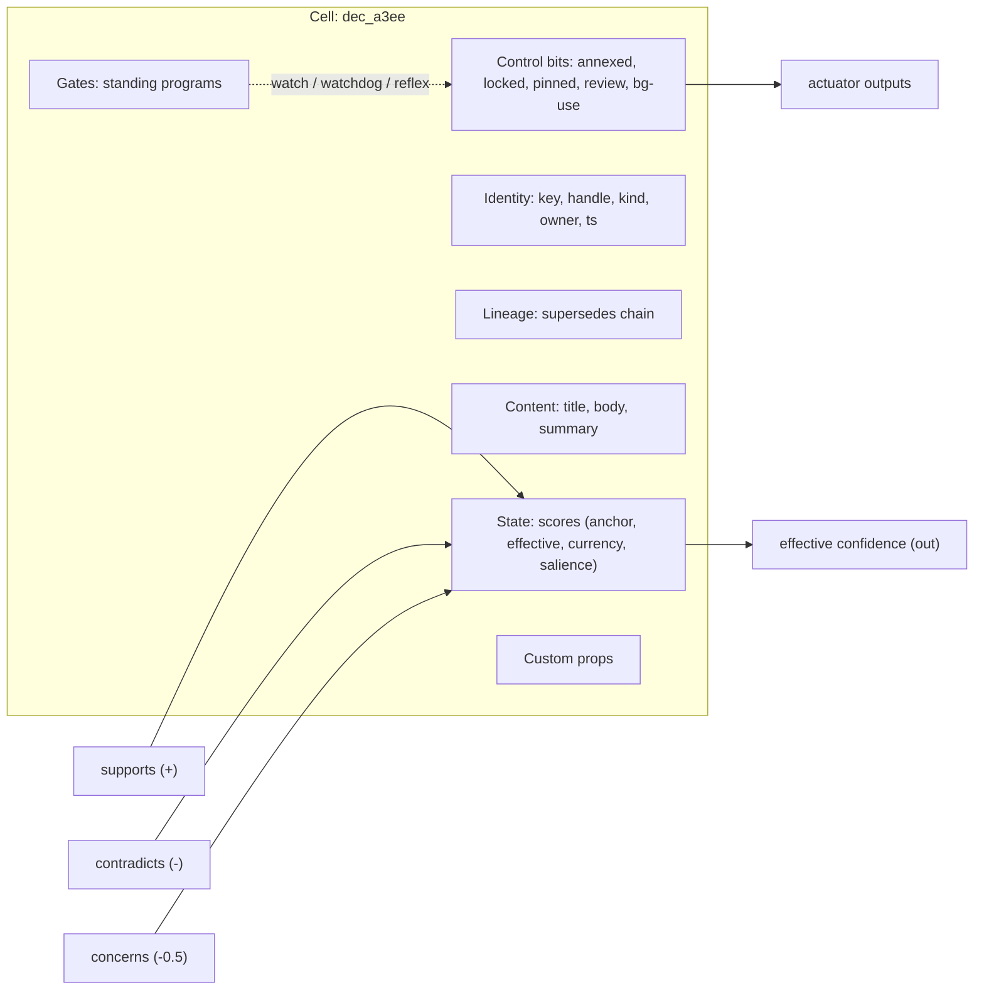
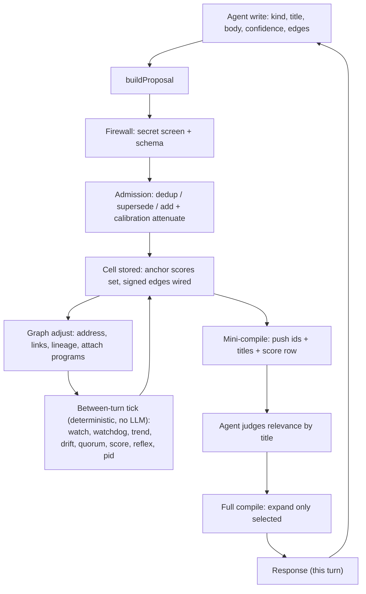

# Recall v5 cell anatomy

Date: 2026-06-23
Status: DECIDED (Item 3)

## The decision

The v5 cell is the current cell's contents, reorganized. The two things the whole
system computes on, the edges and the scores, live today inside an untyped
`data: Record<string, unknown>` bag. v5 lifts them out into typed first-class
primitives. `type` is collapsed into `kind` (one memory class). Nothing essential
is invented; the important parts are un-hidden.

## Field set (component view)

A cell is a component (LinuxCNC HAL lens): identity + content + pins + state +
control bits + attached gates.

| Group | Fields | Type | Notes |
|-------|--------|------|-------|
| Identity | key, handle, kind, owner, timestamp | id / string | stable hex key + typed handle (`dec_a3ee`); owner promoted from provenance |
| Lineage | supersedes chain / status | edges | first-class version chain; resolve to live head |
| Content | title, body, summary | text | |
| Pins | signed edges (supports +, contradicts -, concerns -0.5), depends_on | edge (float weight) | the value-bearing relations, out of the bag |
| State | scores: stated-anchor, effective, currency, salience | float block | one ordered, addressable legend (see write-time-scores.md) |
| Control bits | annexed, locked, pinned, requires_review, allow_background_use | bit | the actuators |
| Gates | attached standing programs | ref | programs watching this cell |
| Custom | typed properties bag | mixed | the rest of `data`, but typed |
| Scope | project, tenant | string | also the residency key |

Dropped: the long `cellAddress` path (the hex handle replaces it), the separate
`type` tag (folded into `kind`), likely `signature_status`.

## The cell as a component

## Lifecycle: how a value moves through a cell

## Why this shape

- Edges and scores are first-class, so the deterministic op layer (watch /
  watchdog / trend / reflex / pid / ...) reads and writes them directly, by
  address `(cell.field)`, instead of digging through an untyped bag.
- The model sets only the stated-anchor leaf values; every derived value
  (effective, currency, salience, the edge masses) is deterministic math over
  those leaves. Subjectivity is confined to the leaves.
- Supersession lineage and annex (a control bit) replace delete and rollback:
  nothing is destroyed, the live value is resolved through the chain.

## See also

- `docs/PLAN.md` (Items 3, 4, 5, 10)
- `docs/design/write-time-scores.md` (the ordered scores legend)
- `docs/subsystems/R0-foundation.md` (the current code this rewrites)
